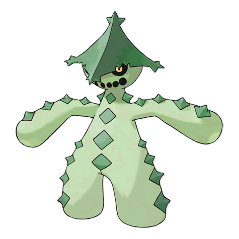

# Cacturne (#0332)

*Scarecrow Pokemon*

**Type:** Erba / Buio
**Abilities:** [[Sand Veil]], [[Water Absorb]] *(Hidden)*
**Base HP:** 4

> They only move during the night. If they spot a traveler, Cacturnes will stalk them in groups, waiting for the exhausted creatures to sleep before attacking. Their insides are actually sand.

---

## Statistiche (Attributes & Limits)

| Attribute | Base / Limit |
|---|---|
| **Strength** | 3/6 |
| **Dexterity** | 2/4 |
| **Vitality** | 2/4 |
| **Special** | 3/6 |
| **Insight** | 2/4 |

---

## Mosse (Learnset)

- **Starter:** [[Poison_Sting|Poison Sting]], [[Leer|Leer]]
- **Beginner:** [[Absorb|Absorb]], [[Growth|Growth]]
- **Amateur:** [[Payback|Payback]], [[Spiky_Shield|Spiky Shield]], [[Leech_Seed|Leech Seed]], [[Sand_Attack|Sand Attack]], [[Pin_Missile|Pin Missile]], [[Ingrain|Ingrain]], [[Feint_Attack|Feint Attack]], [[Spikes|Spikes]], [[Energy_Ball|Energy Ball]]
- **Ace:** [[Revenge|Revenge]], [[Sucker_Punch|Sucker Punch]], [[Needle_Arm|Needle Arm]], [[Cotton_Spore|Cotton Spore]], [[Sandstorm|Sandstorm]], [[Destiny_Bond|Destiny Bond]]
- **Pro:** [[Drain_Punch|Drain Punch]], [[Spite|Spite]], [[Seed_Bomb|Seed Bomb]]

---

## Correlati

### Catena Evolutiva
- [[0331_Cacnea|Cacnea]]
- [[0332_Cacturne|Cacturne]]
