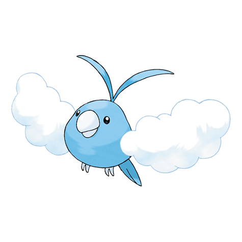

# Swablu (#0333)

*Cotton Bird Pokemon*

**Type:** Normale / Volante
**Abilities:** [[Natural Cure]], [[Cloud Nine]] *(Hidden)*
**Base HP:** 3

> Their wings are made of cotton clouds. They are friendly creatures that love to be near humans, usually sitting on their heads as cotton hats. They travel in flocks and live near towns during the Spring.

---

## Statistiche (Attributes & Limits)

| Attribute | Base / Limit |
|---|---|
| **Strength** | 1/3 |
| **Dexterity** | 2/4 |
| **Vitality** | 2/4 |
| **Special** | 1/3 |
| **Insight** | 2/5 |

---

## Mosse (Learnset)

- **Starter:** [[Peck|Peck]], [[Growl|Growl]]
- **Beginner:** [[Astonish|Astonish]], [[Sing|Sing]], [[Fury_Attack|Fury Attack]]
- **Amateur:** [[Safeguard|Safeguard]], [[Disarming_Voice|Disarming Voice]], [[Mist|Mist]], [[Round|Round]], [[Natural_Gift|Natural Gift]], [[Take_Down|Take Down]], [[Refresh|Refresh]], [[Mirror_Move|Mirror Move]]
- **Ace:** [[Cotton_Guard|Cotton Guard]], [[Dragon_Pulse|Dragon Pulse]], [[Perish_Song|Perish Song]], [[Moonblast|Moonblast]]
- **Pro:** [[Roost|Roost]], [[Feather_Dance|Feather Dance]], [[Agility|Agility]]

---

## Correlati

### Catena Evolutiva
- [[0333_Swablu|Swablu]]
- [[0334_Altaria|Altaria]]
- Altaria (Mega Form)
