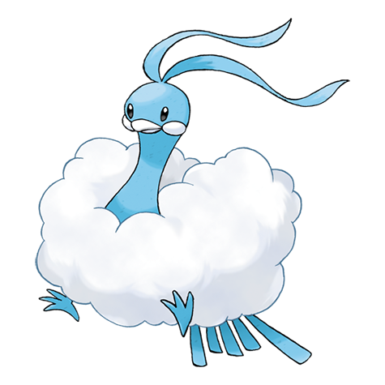
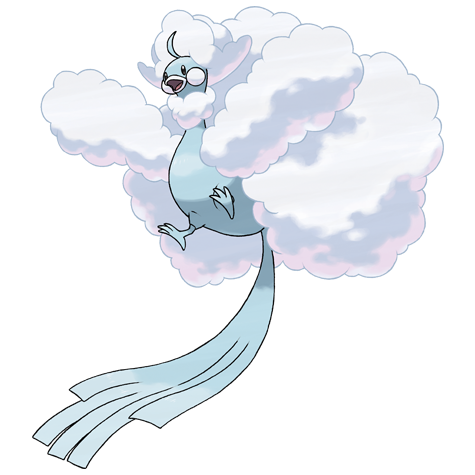

# Altaria (#0334)

*Humming Pokemon*

**Type:** Drago / Volante
**Abilities:** [[Natural Cure]], [[Cloud Nine]] *(Hidden)*
**Base HP:** 4

> Seen as dancing clouds in the sky, Altarias sing melodies in their sweet voices, evoking wonder, beauty and dreams to the listeners. They live far away from people and throw colorful fireballs at uninvited guests.

---

## Statistiche (Attributes & Limits)

| Attribute | Base / Limit |
|---|---|
| **Strength** | 2/5 |
| **Dexterity** | 2/5 |
| **Vitality** | 2/5 |
| **Special** | 2/5 |
| **Insight** | 3/6 |

---

## Mosse (Learnset)

- **Starter:** [[Growl|Growl]], [[Peck|Peck]]
- **Beginner:** [[Pluck|Pluck]], [[Astonish|Astonish]], [[Sing|Sing]], [[Fury_Attack|Fury Attack]]
- **Amateur:** [[Safeguard|Safeguard]], [[Disarming_Voice|Disarming Voice]], [[Mist|Mist]], [[Round|Round]], [[Natural_Gift|Natural Gift]], [[Take_Down|Take Down]], [[Refresh|Refresh]], [[Dragon_Dance|Dragon Dance]], [[Dragon_Breath|Dragon Breath]]
- **Ace:** [[Cotton_Guard|Cotton Guard]], [[Dragon_Pulse|Dragon Pulse]], [[Perish_Song|Perish Song]], [[Moonblast|Moonblast]], [[Sky_Attack|Sky Attack]]
- **Pro:** [[Power_Swap|Power Swap]], [[Draco_Meteor|Draco Meteor]], [[Dragon_Rush|Dragon Rush]]

---

## Correlati

### Catena Evolutiva
- [[0333_Swablu|Swablu]]
- [[0334_Altaria|Altaria]]
- Altaria (Mega Form)

---

## Mega Altaria (#0334M1)

**Type:** Drago / Folletto
**Abilities:** [[Pixilate]]
**Base HP:** 5

| Attribute | Base / Limit |
|---|---|
| **Strength** | 3/6 |
| **Dexterity** | 2/5 |
| **Vitality** | 3/6 |
| **Special** | 3/6 |
| **Insight** | 3/6 |

### Mosse

- **Starter:** [[Growl|Growl]], [[Peck|Peck]]
- **Beginner:** [[Pluck|Pluck]], [[Astonish|Astonish]], [[Sing|Sing]], [[Fury_Attack|Fury Attack]]
- **Amateur:** [[Safeguard|Safeguard]], [[Disarming_Voice|Disarming Voice]], [[Mist|Mist]], [[Round|Round]], [[Natural_Gift|Natural Gift]], [[Take_Down|Take Down]], [[Refresh|Refresh]], [[Dragon_Dance|Dragon Dance]], [[Dragon_Breath|Dragon Breath]]
- **Ace:** [[Cotton_Guard|Cotton Guard]], [[Dragon_Pulse|Dragon Pulse]], [[Perish_Song|Perish Song]], [[Moonblast|Moonblast]], [[Sky_Attack|Sky Attack]]
- **Pro:** [[Power_Swap|Power Swap]], [[Draco_Meteor|Draco Meteor]], [[Dragon_Rush|Dragon Rush]]
