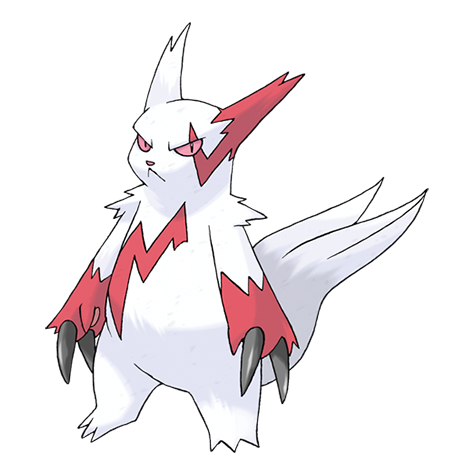

# Zangoose (#0335)

*Cat Ferret Pokemon*

**Type:** Normale
**Abilities:** [[Immunity]], [[Toxic Boost]] *(Hidden)*
**Base HP:** 4

> The sole desire to battle Sevipers is embedded in their genes, they have been rivals since forever. Zangoose is a very agile quadruped, standing up on two legs only when ready to fight.

---

## Statistiche (Attributes & Limits)

| Attribute | Base / Limit |
|---|---|
| **Strength** | 3/6 |
| **Dexterity** | 2/5 |
| **Vitality** | 2/4 |
| **Special** | 2/4 |
| **Insight** | 2/4 |

---

## Mosse (Learnset)

- **Starter:** [[Scratch|Scratch]], [[Leer|Leer]]
- **Beginner:** [[Quick_Attack|Quick Attack]], [[Fury_Cutter|Fury Cutter]]
- **Amateur:** [[Pursuit|Pursuit]], [[Slash|Slash]], [[Hone_Claws|Hone Claws]], [[Embargo|Embargo]], [[Crush_Claw|Crush Claw]], [[Revenge|Revenge]], [[False_Swipe|False Swipe]], [[Detect|Detect]]
- **Ace:** [[X_Scissor|X-Scissor]], [[Taunt|Taunt]], [[Swords_Dance|Swords Dance]], [[Close_Combat|Close Combat]]
- **Pro:** [[Night_Slash|Night Slash]], [[Fury_Swipes|Fury Swipes]], [[Metal_Claw|Metal Claw]]

---

