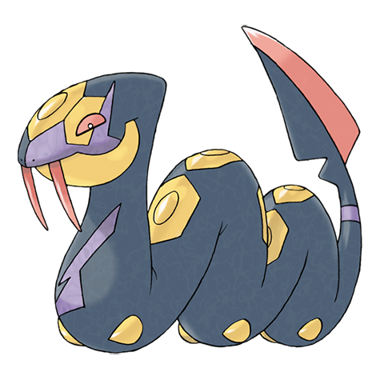

# Seviper (#0336)

*Fang Snake Pokemon*

**Type:** Veleno
**Abilities:** [[Shed Skin]], [[Infiltrator]] *(Hidden)*
**Base HP:** 4

> Their hate for the Zangoose has been boiling for so long it’s now a basic instinct. They battle using their sword-edged poisonous tail, hiding in tall grass until an unwary prey gets close enough.

---

## Statistiche (Attributes & Limits)

| Attribute | Base / Limit |
|---|---|
| **Strength** | 3/6 |
| **Dexterity** | 2/4 |
| **Vitality** | 2/4 |
| **Special** | 3/6 |
| **Insight** | 2/4 |

---

## Mosse (Learnset)

- **Starter:** [[Wrap|Wrap]], [[Swagger|Swagger]]
- **Beginner:** [[Bite|Bite]], [[Lick|Lick]], [[Feint|Feint]], [[Poison_Tail|Poison Tail]]
- **Amateur:** [[Screech|Screech]], [[Venoshock|Venoshock]], [[Glare|Glare]], [[Poison_Fang|Poison Fang]], [[Venom_Drench|Venom Drench]], [[Night_Slash|Night Slash]], [[Gastro_Acid|Gastro Acid]], [[Belch|Belch]], [[Haze|Haze]]
- **Ace:** [[Poison_Jab|Poison Jab]], [[Crunch|Crunch]], [[Swords_Dance|Swords Dance]], [[Coil|Coil]], [[Wring_Out|Wring Out]]
- **Pro:** [[Aqua_Tail|Aqua Tail]], [[Giga_Drain|Giga Drain]], [[Iron_Tail|Iron Tail]]

---

