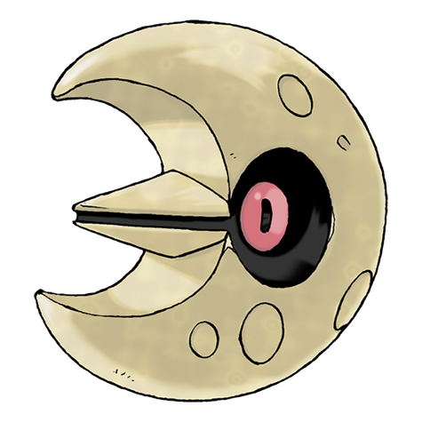

# Lunatone (#0337)

*Meteorite Pokemon*

**Type:** Roccia / Psico
**Abilities:** [[Levitate]]
**Base HP:** 4

> First found where a meteorite fell. For this reason it’s believed it came from space. Its eyes fill people with dread and lure them to sleep. They become very active and extremely powerful during full moons.

---

## Statistiche (Attributes & Limits)

| Attribute | Base / Limit |
|---|---|
| **Strength** | 2/4 |
| **Dexterity** | 2/5 |
| **Vitality** | 2/4 |
| **Special** | 3/6 |
| **Insight** | 2/5 |

---

## Mosse (Learnset)

- **Starter:** [[Harden|Harden]], [[Tackle|Tackle]], [[Moonblast|Moonblast]]
- **Beginner:** [[Confusion|Confusion]], [[Hypnosis|Hypnosis]], [[Rock_Throw|Rock Throw]]
- **Amateur:** [[Power_Gem|Power Gem]], [[Rock_Polish|Rock Polish]], [[Psyshock|Psyshock]], [[Embargo|Embargo]], [[Psywave|Psywave]], [[Cosmic_Power|Cosmic Power]], [[Rock_Slide|Rock Slide]], [[Heal_Block|Heal Block]], [[Psychic|Psychic]]
- **Ace:** [[Stone_Edge|Stone Edge]], [[Explosion|Explosion]], [[Future_Sight|Future Sight]], [[Magic_Room|Magic Room]]
- **Pro:** [[Trick_Room|Trick Room]], [[Magic_Coat|Magic Coat]], [[Skill_Swap|Skill Swap]]

---

