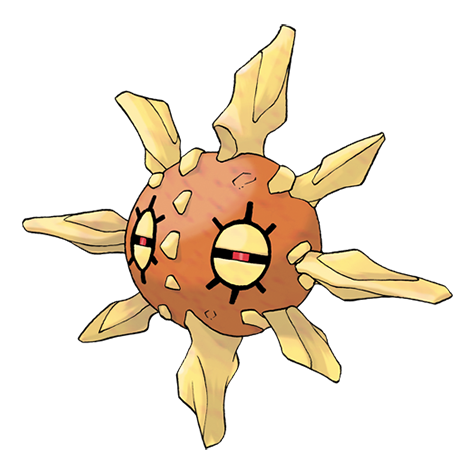

# Solrock (#0338)

*Meteorite Pokemon*

**Type:** Roccia / Psico
**Abilities:** [[Levitate]]
**Base HP:** 4

> People say it came from space. They release the purest light when they get angry. Usually found absorbing solar light during the day, Solrocks can emit blinding lights and burning heat while spinning.

---

## Statistiche (Attributes & Limits)

| Attribute | Base / Limit |
|---|---|
| **Strength** | 3/6 |
| **Dexterity** | 2/5 |
| **Vitality** | 2/5 |
| **Special** | 2/4 |
| **Insight** | 2/4 |

---

## Mosse (Learnset)

- **Starter:** [[Tackle|Tackle]], [[Harden|Harden]], [[Solar_Beam|Solar Beam]]
- **Beginner:** [[Fire_Spin|Fire Spin]], [[Confusion|Confusion]], [[Rock_Throw|Rock Throw]]
- **Amateur:** [[Rock_Polish|Rock Polish]], [[Psywave|Psywave]], [[Embargo|Embargo]], [[Rock_Slide|Rock Slide]], [[Cosmic_Power|Cosmic Power]], [[Psychic|Psychic]], [[Heal_Block|Heal Block]]
- **Ace:** [[Stone_Edge|Stone Edge]], [[Explosion|Explosion]], [[Flare_Blitz|Flare Blitz]], [[Wonder_Room|Wonder Room]]
- **Pro:** [[Magic_Coat|Magic Coat]], [[Sunny_Day|Sunny Day]], [[Skill_Swap|Skill Swap]]

---

