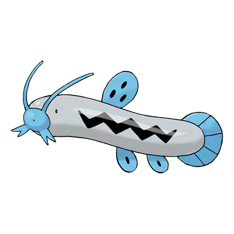

# Barboach (#0339)

*Whiskers Pokemon*

**Type:** Acqua / Terra
**Abilities:** [[Oblivious]], [[Anticipation]], [[Hydration]] *(Hidden)*
**Base HP:** 3

> Their whiskers work as a super sensitive radar. They hide in the mud with only their whiskers exposed, waiting for prey to come. If the mud dries, they move back into the water.

---

## Statistiche (Attributes & Limits)

| Attribute | Base / Limit |
|---|---|
| **Strength** | 2/4 |
| **Dexterity** | 2/4 |
| **Vitality** | 1/3 |
| **Special** | 2/4 |
| **Insight** | 1/3 |

---

## Mosse (Learnset)

- **Starter:** [[Mud_Slap|Mud Slap]]
- **Beginner:** [[Mud_Sport|Mud Sport]], [[Water_Sport|Water Sport]], [[Water_Gun|Water Gun]]
- **Amateur:** [[Mud_Bomb|Mud Bomb]], [[Amnesia|Amnesia]], [[Water_Pulse|Water Pulse]], [[Magnitude|Magnitude]], [[Rest|Rest]], [[Snore|Snore]], [[Aqua_Tail|Aqua Tail]]
- **Ace:** [[Earthquake|Earthquake]], [[Muddy_Water|Muddy Water]], [[Future_Sight|Future Sight]], [[Fissure|Fissure]]
- **Pro:** [[Dive|Dive]], [[Flail|Flail]], [[Mud_Shot|Mud Shot]]

---

## Correlati

### Catena Evolutiva
- [[0339_Barboach|Barboach]]
- [[0340_Whiscash|Whiscash]]
