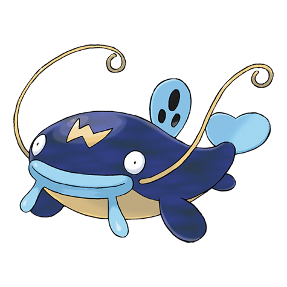

# Whiscash (#0340)

*Whiskers Pokemon*

**Type:** Acqua / Terra
**Abilities:** [[Oblivious]], [[Anticipation]], [[Hydration]] *(Hidden)*
**Base HP:** 5

> Dangerous and territorial, they claim entire ponds as their homes and will crush whoever dares to dive in with earthquakes. They eat anything alive in their pond or swamp. They have learned to foretell real tremors.

---

## Statistiche (Attributes & Limits)

| Attribute | Base / Limit |
|---|---|
| **Strength** | 2/5 |
| **Dexterity** | 2/4 |
| **Vitality** | 2/5 |
| **Special** | 2/5 |
| **Insight** | 2/5 |

---

## Mosse (Learnset)

- **Starter:** [[Mud_Slap|Mud Slap]], [[Tickle|Tickle]]
- **Beginner:** [[Mud_Sport|Mud Sport]], [[Water_Sport|Water Sport]], [[Water_Gun|Water Gun]]
- **Amateur:** [[Belch|Belch]], [[Mud_Bomb|Mud Bomb]], [[Amnesia|Amnesia]], [[Water_Pulse|Water Pulse]], [[Magnitude|Magnitude]], [[Rest|Rest]], [[Snore|Snore]], [[Aqua_Tail|Aqua Tail]]
- **Ace:** [[Thrash|Thrash]], [[Zen_Headbutt|Zen Headbutt]], [[Earthquake|Earthquake]], [[Muddy_Water|Muddy Water]], [[Future_Sight|Future Sight]], [[Fissure|Fissure]]
- **Pro:** [[Dragon_Dance|Dragon Dance]], [[Bounce|Bounce]], [[Spark|Spark]]

---

## Correlati

### Catena Evolutiva
- [[0339_Barboach|Barboach]]
- [[0340_Whiscash|Whiscash]]
