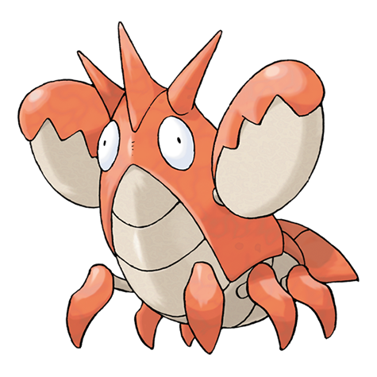

# Corphish (#0341)

*Ruffian Pokemon*

**Type:** Acqua
**Abilities:** [[Hyper Cutter]], [[Shell Armor]], [[Adaptability]] *(Hidden)*
**Base HP:** 3

> Corphish were originally foreign Pokemon that were imported as pets. They eventually turned up in the wild and reproduced a lot. They are resilient and can live in polluted water. Beware of their pincers.

---

## Statistiche (Attributes & Limits)

| Attribute | Base / Limit |
|---|---|
| **Strength** | 2/5 |
| **Dexterity** | 1/3 |
| **Vitality** | 2/4 |
| **Special** | 2/4 |
| **Insight** | 1/3 |

---

## Mosse (Learnset)

- **Starter:** [[Bubble|Bubble]], [[Leer|Leer]]
- **Beginner:** [[Vice_Grip|Vice Grip]], [[Harden|Harden]]
- **Amateur:** [[Bubble_Beam|Bubble Beam]], [[Protect|Protect]], [[Double_Hit|Double Hit]], [[Knock_Off|Knock Off]], [[Taunt|Taunt]], [[Night_Slash|Night Slash]], [[Crabhammer|Crabhammer]]
- **Ace:** [[Razor_Shell|Razor Shell]], [[Swords_Dance|Swords Dance]], [[Crunch|Crunch]], [[Guillotine|Guillotine]]
- **Pro:** [[Metal_Claw|Metal Claw]], [[Endeavor|Endeavor]], [[Chip_Away|Chip Away]]

---

## Correlati

### Catena Evolutiva
- [[0341_Corphish|Corphish]]
- [[0342_Crawdaunt|Crawdaunt]]
