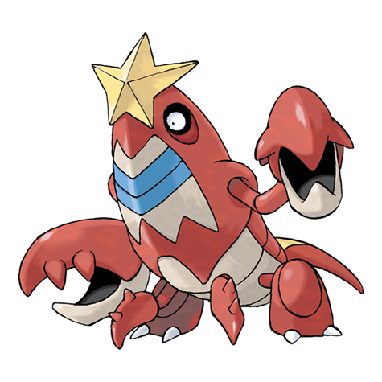

# Crawdaunt (#0342)

*Rogue Pokemon*

**Type:** Acqua / Buio
**Abilities:** [[Hyper Cutter]], [[Shell Armor]], [[Adaptability]] *(Hidden)*
**Base HP:** 4

> Crawdaunt is extremely violent and territorial. The ponds where it lives look like desolated places due to them attacking anything that comes close. It sheds its shell once a year, this weakens it for a few days.

---

## Statistiche (Attributes & Limits)

| Attribute | Base / Limit |
|---|---|
| **Strength** | 3/7 |
| **Dexterity** | 2/4 |
| **Vitality** | 2/5 |
| **Special** | 2/5 |
| **Insight** | 2/4 |

---

## Mosse (Learnset)

- **Starter:** [[Bubble|Bubble]], [[Leer|Leer]]
- **Beginner:** [[Vice_Grip|Vice Grip]], [[Harden|Harden]]
- **Amateur:** [[Bubble_Beam|Bubble Beam]], [[Protect|Protect]], [[Double_Hit|Double Hit]], [[Knock_Off|Knock Off]], [[Taunt|Taunt]], [[Night_Slash|Night Slash]], [[Crabhammer|Crabhammer]]
- **Ace:** [[Razor_Shell|Razor Shell]], [[Swords_Dance|Swords Dance]], [[Crunch|Crunch]], [[Guillotine|Guillotine]]
- **Pro:** [[Superpower|Superpower]], [[Dragon_Dance|Dragon Dance]], [[Mud_Sport|Mud Sport]]

---

## Correlati

### Catena Evolutiva
- [[0341_Corphish|Corphish]]
- [[0342_Crawdaunt|Crawdaunt]]
