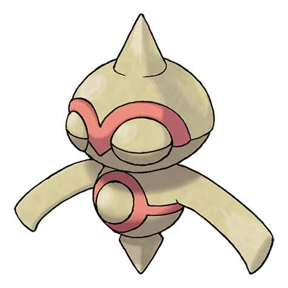

# Baltoy (#0343)

*Clay Doll Pokemon*

**Type:** Terra / Psico
**Abilities:** [[Levitate]]
**Base HP:** 3

> They spin on their center to move around. When a group of them gathers they create a horrible, headache inducing noise at unison. Old paintings describe them living with people in ancient times.

---

## Statistiche (Attributes & Limits)

| Attribute | Base / Limit |
|---|---|
| **Strength** | 1/3 |
| **Dexterity** | 2/4 |
| **Vitality** | 2/4 |
| **Special** | 1/3 |
| **Insight** | 2/5 |

---

## Mosse (Learnset)

- **Starter:** [[Confusion|Confusion]], [[Harden|Harden]]
- **Beginner:** [[Rapid_Spin|Rapid Spin]], [[Mud_Slap|Mud Slap]], [[Rock_Tomb|Rock Tomb]]
- **Amateur:** [[Heal_Block|Heal Block]], [[Psybeam|Psybeam]], [[Power_Trick|Power Trick]], [[Ancient_Power|Ancient Power]], [[Self_Destruct|Self Destruct]], [[Guard_Split|Guard Split]], [[Cosmic_Power|Cosmic Power]], [[Power_Split|Power Split]]
- **Ace:** [[Extrasensory|Extrasensory]], [[Earth_Power|Earth Power]], [[Sandstorm|Sandstorm]], [[Explosion|Explosion]]
- **Pro:** [[Gravity|Gravity]], [[Signal_Beam|Signal Beam]], [[Trick|Trick]]

---

## Correlati

### Catena Evolutiva
- [[0343_Baltoy|Baltoy]]
- [[0344_Claydol|Claydol]]
