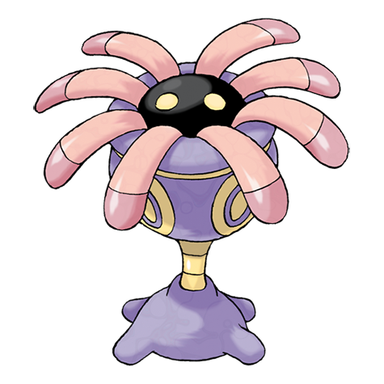

# Lileep (#0345)

*Sea Lily Pokemon*

**Type:** Roccia / Erba
**Abilities:** [[Suction Cups]], [[Storm Drain]] *(Hidden)*
**Base HP:** 3

> Over 100 million years ago, Lileep used to attach themselves to rocks at the bottom of the sea. A catastrophe led them all to extinction. A few fossils were found and some were revived by scientists.

---

## Statistiche (Attributes & Limits)

| Attribute | Base / Limit |
|---|---|
| **Strength** | 1/3 |
| **Dexterity** | 1/3 |
| **Vitality** | 2/5 |
| **Special** | 2/4 |
| **Insight** | 2/5 |

---

## Mosse (Learnset)

- **Starter:** [[Astonish|Astonish]], [[Constrict|Constrict]]
- **Beginner:** [[Acid|Acid]]
- **Amateur:** [[Ingrain|Ingrain]], [[Brine|Brine]], [[Confuse_Ray|Confuse Ray]], [[Giga_Drain|Giga Drain]], [[Amnesia|Amnesia]], [[Gastro_Acid|Gastro Acid]], [[Ancient_Power|Ancient Power]], [[Energy_Ball|Energy Ball]]
- **Ace:** [[Spit_Up|Spit Up]], [[Stockpile|Stockpile]], [[Swallow|Swallow]], [[Wring_Out|Wring Out]]
- **Pro:** [[Earth_Power|Earth Power]], [[Stealth_Rock|Stealth Rock]], [[Tickle|Tickle]]

---

## Correlati

### Catena Evolutiva
- [[0345_Lileep|Lileep]]
- [[0346_Cradily|Cradily]]
