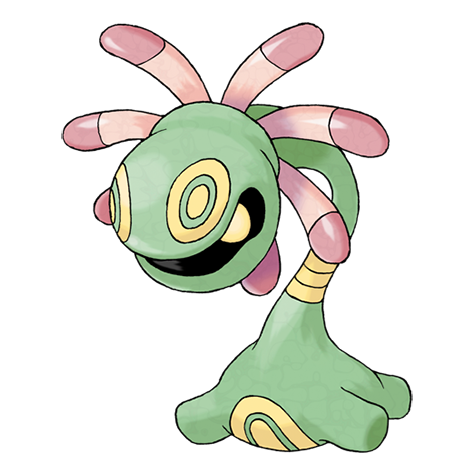

# Cradily (#0346)

*Barnacle Pokemon*

**Type:** Roccia / Erba
**Abilities:** [[Suction Cups]], [[Storm Drain]] *(Hidden)*
**Base HP:** 4

> Cradily moves slowly at the bottom of the sea. It uses its body as an anchor and its tentacles as arms to catch prey. Their foes are melted with a potent acid before being consumed.

---

## Statistiche (Attributes & Limits)

| Attribute | Base / Limit |
|---|---|
| **Strength** | 2/5 |
| **Dexterity** | 1/3 |
| **Vitality** | 3/6 |
| **Special** | 2/5 |
| **Insight** | 3/6 |

---

## Mosse (Learnset)

- **Starter:** [[Constrict|Constrict]], [[Astonish|Astonish]]
- **Beginner:** [[Acid|Acid]]
- **Amateur:** [[Ingrain|Ingrain]], [[Spit_Up|Spit Up]], [[Stockpile|Stockpile]], [[Swallow|Swallow]], [[Wring_Out|Wring Out]], [[Brine|Brine]], [[Confuse_Ray|Confuse Ray]], [[Giga_Drain|Giga Drain]]
- **Ace:** [[Amnesia|Amnesia]], [[Ancient_Power|Ancient Power]], [[Gastro_Acid|Gastro Acid]], [[Energy_Ball|Energy Ball]]
- **Pro:** [[Worry_Seed|Worry Seed]], [[Stealth_Rock|Stealth Rock]], [[Seed_Bomb|Seed Bomb]]

---

## Correlati

### Catena Evolutiva
- [[0345_Lileep|Lileep]]
- [[0346_Cradily|Cradily]]
