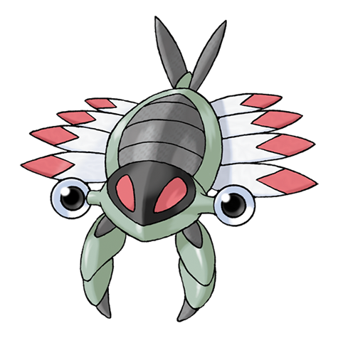

# Anorith (#0347)

*Old Shrimp Pokemon*

**Type:** Roccia / Insetto
**Abilities:** [[Battle Armor]], [[Swift Swim]] *(Hidden)*
**Base HP:** 3

> This ancient Pokemon is thought to be the common ancestor of many modern Bug Pokemon. The fossils show it lived in big schools and it preferred warm waters. Anoriths used their claws to catch small prey.

---

## Statistiche (Attributes & Limits)

| Attribute | Base / Limit |
|---|---|
| **Strength** | 3/6 |
| **Dexterity** | 2/5 |
| **Vitality** | 2/4 |
| **Special** | 1/3 |
| **Insight** | 2/4 |

---

## Mosse (Learnset)

- **Starter:** [[Harden|Harden]], [[Scratch|Scratch]]
- **Beginner:** [[Mud_Sport|Mud Sport]]
- **Amateur:** [[Water_Gun|Water Gun]], [[Smack_Down|Smack Down]], [[Metal_Claw|Metal Claw]], [[Protect|Protect]], [[Ancient_Power|Ancient Power]], [[Fury_Cutter|Fury Cutter]], [[Bug_Bite|Bug Bite]], [[Slash|Slash]]
- **Ace:** [[Brine|Brine]], [[Rock_Blast|Rock Blast]], [[Crush_Claw|Crush Claw]], [[X_Scissor|X-Scissor]]
- **Pro:** [[Knock_Off|Knock Off]], [[Rapid_Spin|Rapid Spin]], [[Aqua_Jet|Aqua Jet]]

---

## Correlati

### Catena Evolutiva
- [[0347_Anorith|Anorith]]
- [[0348_Armaldo|Armaldo]]
