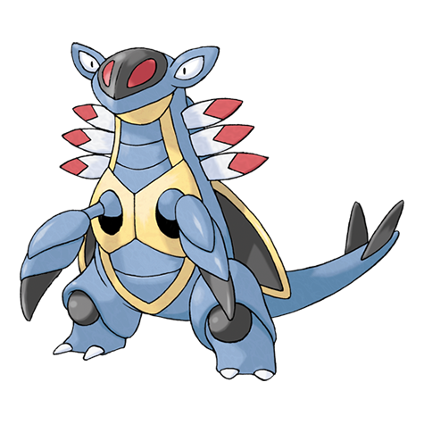

# Armaldo (#0348)

*Plate Pokemon*

**Type:** Roccia / Insetto
**Abilities:** [[Battle Armor]], [[Swift Swim]] *(Hidden)*
**Base HP:** 4

> When the waters receded, this Pokemon was forced to evolve to live on land. Evidence suggests that its claws could extend to reach the prey that was far or underwater. Its tough shell made it very resilient.

---

## Statistiche (Attributes & Limits)

| Attribute | Base / Limit |
|---|---|
| **Strength** | 3/7 |
| **Dexterity** | 2/4 |
| **Vitality** | 3/6 |
| **Special** | 2/5 |
| **Insight** | 2/5 |

---

## Mosse (Learnset)

- **Starter:** [[Scratch|Scratch]], [[Harden|Harden]]
- **Beginner:** [[Mud_Sport|Mud Sport]]
- **Amateur:** [[Metal_Claw|Metal Claw]], [[Water_Gun|Water Gun]], [[Ancient_Power|Ancient Power]], [[Protect|Protect]], [[Slash|Slash]], [[Fury_Cutter|Fury Cutter]]
- **Ace:** [[Crush_Claw|Crush Claw]], [[Smack_Down|Smack Down]], [[Brine|Brine]], [[Rock_Blast|Rock Blast]], [[X_Scissor|X-Scissor]]
- **Pro:** [[Cross_Poison|Cross Poison]], [[Aqua_Tail|Aqua Tail]], [[Iron_Defense|Iron Defense]]

---

## Correlati

### Catena Evolutiva
- [[0347_Anorith|Anorith]]
- [[0348_Armaldo|Armaldo]]
