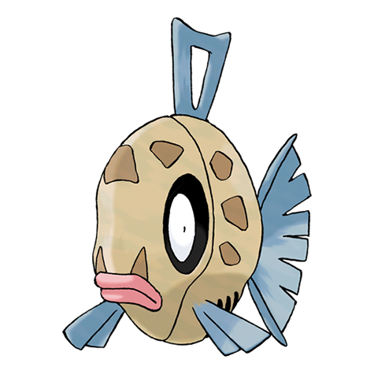

# Feebas (#0349)

*Fish Pokemon*

**Type:** Acqua
**Abilities:** [[Swift Swim]], [[Oblivious]], [[Adaptability]] *(Hidden)*
**Base HP:** 3

> This Pokemon tastes awful, it is incredibly ugly, smelly, kind of dumb and a terrible fighter. To make things worse, it is actually extremely rare. For those reasons, people tend to avoid it and it’s usually ignored

---

## Statistiche (Attributes & Limits)

| Attribute | Base / Limit |
|---|---|
| **Strength** | 1/2 |
| **Dexterity** | 2/5 |
| **Vitality** | 1/3 |
| **Special** | 1/2 |
| **Insight** | 2/4 |

---

## Mosse (Learnset)

- **Starter:** [[Splash|Splash]]
- **Amateur:** [[Tackle|Tackle]], [[Flail|Flail]]
- **Ace:** [[Brine|Brine]]
- **Pro:** [[Mud_Sport|Mud Sport]], [[Dive|Dive]]

---

## Correlati

### Catena Evolutiva
- [[0349_Feebas|Feebas]]
- [[0350_Milotic|Milotic]]
