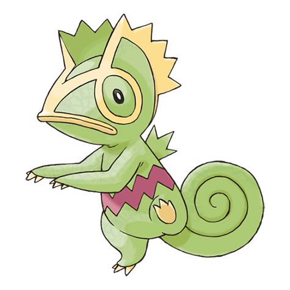

# Kecleon (#0352)

*Color Swap Pokemon*

**Type:** Normale
**Abilities:** [[Color Change]], [[Protean]] *(Hidden)*
**Base HP:** 4

> They are able to change their colors to blend with their surroundings. The only part of its body that can’t change is the red zigzag line on its belly. Kecleon is very sneaky, smart and kind of insolent.

---

## Statistiche (Attributes & Limits)

| Attribute | Base / Limit |
|---|---|
| **Strength** | 2/5 |
| **Dexterity** | 1/3 |
| **Vitality** | 2/5 |
| **Special** | 2/4 |
| **Insight** | 3/7 |

---

## Mosse (Learnset)

- **Starter:** [[Tail_Whip|Tail Whip]], [[Astonish|Astonish]], [[Thief|Thief]]
- **Beginner:** [[Lick|Lick]], [[Scratch|Scratch]], [[Bind|Bind]], [[Feint|Feint]]
- **Amateur:** [[Shadow_Sneak|Shadow Sneak]], [[Fury_Swipes|Fury Swipes]], [[Feint_Attack|Feint Attack]], [[Psybeam|Psybeam]], [[Ancient_Power|Ancient Power]], [[Screech|Screech]], [[Camouflage|Camouflage]]
- **Ace:** [[Substitute|Substitute]], [[Shadow_Claw|Shadow Claw]], [[Synchronoise|Synchronoise]], [[Sucker_Punch|Sucker Punch]]
- **Pro:** [[Snatch|Snatch]], [[Fake_Out|Fake Out]], [[Trick|Trick]]

---

