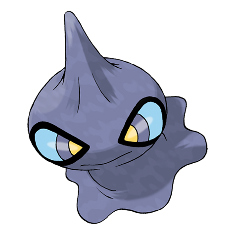

# Shuppet (#0353)

*Puppet Pokemon*

**Type:** Spettro
**Abilities:** [[Insomnia]], [[Frisk]], [[Cursed Body]] *(Hidden)*
**Base HP:** 3

> They feed on dark emotions such as envy, jealousy and vengefulness. If they sting you, they’ll fill you with a vindictive desire. They don’t have bodies under their blanket and they are looking for a body to possess

---

## Statistiche (Attributes & Limits)

| Attribute | Base / Limit |
|---|---|
| **Strength** | 2/5 |
| **Dexterity** | 2/4 |
| **Vitality** | 1/3 |
| **Special** | 2/4 |
| **Insight** | 1/3 |

---

## Mosse (Learnset)

- **Starter:** [[Knock_Off|Knock Off]]
- **Beginner:** [[Screech|Screech]], [[Night_Shade|Night Shade]], [[Spite|Spite]]
- **Amateur:** [[Will_O_Wisp|Will-O-Wisp]], [[Shadow_Sneak|Shadow Sneak]], [[Curse|Curse]], [[Feint_Attack|Feint Attack]], [[Hex|Hex]], [[Shadow_Ball|Shadow Ball]], [[Snatch|Snatch]], [[Embargo|Embargo]]
- **Ace:** [[Sucker_Punch|Sucker Punch]], [[Grudge|Grudge]], [[Trick|Trick]], [[Phantom_Force|Phantom Force]]
- **Pro:** [[Icy_Wind|Icy Wind]], [[Role_Play|Role Play]], [[Destiny_Bond|Destiny Bond]]

---

## Correlati

### Catena Evolutiva
- [[0353_Shuppet|Shuppet]]
- [[0354_Banette|Banette]]
- Banette (Mega Form)
