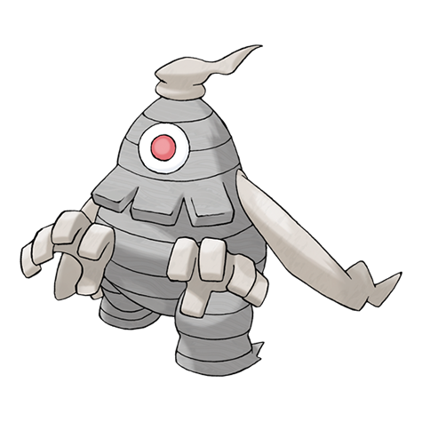

# Dusclops (#0356)

*Beckon Pokemon*

**Type:** Spettro
**Abilities:** [[Levitate]], [[Frisk]] *(Hidden)*
**Base HP:** 4

> Its body is hollow. Some paranormal experts say there is a spectral energy ball inside them but it is not confirmed. If it absorbs an object or a creature there’s the risk that nothing will come back out.

---

## Statistiche (Attributes & Limits)

| Attribute | Base / Limit |
|---|---|
| **Strength** | 2/5 |
| **Dexterity** | 1/3 |
| **Vitality** | 3/7 |
| **Special** | 2/4 |
| **Insight** | 3/7 |

---

## Mosse (Learnset)

- **Starter:** [[Night_Shade|Night Shade]], [[Leer|Leer]]
- **Beginner:** [[Bind|Bind]], [[Disable|Disable]], [[Foresight|Foresight]]
- **Amateur:** [[Fire_Punch|Fire Punch]], [[Ice_Punch|Ice Punch]], [[Astonish|Astonish]], [[Thunder_Punch|Thunder Punch]], [[Shadow_Sneak|Shadow Sneak]], [[Confuse_Ray|Confuse Ray]], [[Curse|Curse]], [[Pursuit|Pursuit]], [[Shadow_Punch|Shadow Punch]], [[Will_O_Wisp|Will-O-Wisp]], [[Hex|Hex]]
- **Ace:** [[Gravity|Gravity]], [[Shadow_Ball|Shadow Ball]], [[Mean_Look|Mean Look]], [[Payback|Payback]], [[Future_Sight|Future Sight]]
- **Pro:** [[Dark_Pulse|Dark Pulse]], [[Memento|Memento]], [[Pain_Split|Pain Split]]

---

## Correlati

### Catena Evolutiva
- [[0355_Duskull|Duskull]]
- [[0356_Dusclops|Dusclops]]
- Dusknoir
