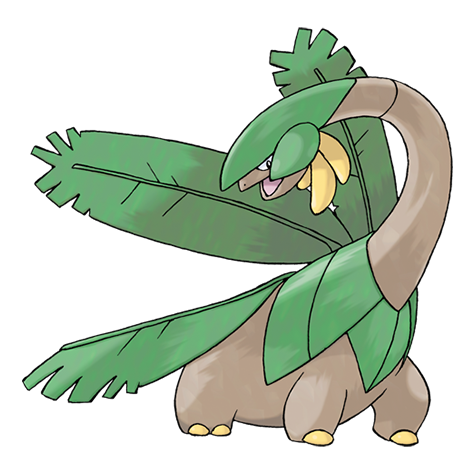

# Tropius (#0357)

*Fruit Pokemon*

**Type:** Erba / Volante
**Abilities:** [[Chlorophyll]], [[Solar Power]], [[Harvest]] *(Hidden)*
**Base HP:** 5

> It is very common in humid and hot regions. It can grow back the fruit it has eaten. Mothers prefer Tropius fruits to feed their children as it is more nutritive and sweet. They are mellow and friendly Pokemon.

---

## Statistiche (Attributes & Limits)

| Attribute | Base / Limit |
|---|---|
| **Strength** | 2/4 |
| **Dexterity** | 2/4 |
| **Vitality** | 2/5 |
| **Special** | 2/5 |
| **Insight** | 2/5 |

---

## Mosse (Learnset)

- **Starter:** [[Bestow|Bestow]], [[Gust|Gust]], [[Leer|Leer]]
- **Beginner:** [[Natural_Gift|Natural Gift]], [[Growth|Growth]]
- **Amateur:** [[Razor_Leaf|Razor Leaf]], [[Stomp|Stomp]], [[Sweet_Scent|Sweet Scent]], [[Whirlwind|Whirlwind]], [[Magical_Leaf|Magical Leaf]], [[Body_Slam|Body Slam]], [[Synthesis|Synthesis]]
- **Ace:** [[Leaf_Tornado|Leaf Tornado]], [[Air_Slash|Air Slash]], [[Solar_Beam|Solar Beam]], [[Leaf_Storm|Leaf Storm]]
- **Pro:** [[Tailwind|Tailwind]], [[Twister|Twister]], [[Outrage|Outrage]]

---

