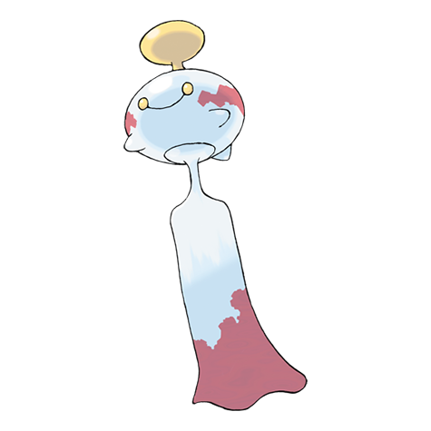

# Chimecho (#0358)

*Wind Chime Pokemon*

**Type:** Psico
**Abilities:** [[Levitate]]
**Base HP:** 4

> They have seven different cries that resound with the wind. They can create ultrasonic waves when they are in danger. Using the suction cup on their head, they hang to branches on windy days.

---

## Statistiche (Attributes & Limits)

| Attribute | Base / Limit |
|---|---|
| **Strength** | 2/4 |
| **Dexterity** | 2/4 |
| **Vitality** | 2/5 |
| **Special** | 3/6 |
| **Insight** | 2/5 |

---

## Mosse (Learnset)

- **Starter:** [[Wrap|Wrap]]
- **Beginner:** [[Astonish|Astonish]], [[Growl|Growl]]
- **Amateur:** [[Uproar|Uproar]], [[Confusion|Confusion]], [[Yawn|Yawn]], [[Take_Down|Take Down]], [[Safeguard|Safeguard]], [[Psywave|Psywave]], [[Healing_Wish|Healing Wish]], [[Heal_Bell|Heal Bell]]
- **Ace:** [[Double_Edge|Double-Edge]], [[Extrasensory|Extrasensory]], [[Heal_Pulse|Heal Pulse]], [[Synchronoise|Synchronoise]]
- **Pro:** [[Recover|Recover]], [[Cosmic_Power|Cosmic Power]], [[Stored_Power|Stored Power]]

---

