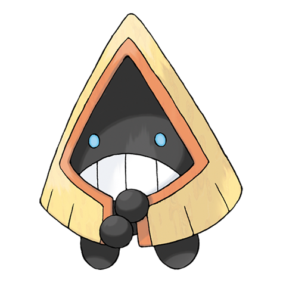

# Snorunt (#0361)

*Snow Hat Pokemon*

**Type:** Ghiaccio
**Abilities:** [[Inner Focus]], [[Ice Body]], [[Moody]] *(Hidden)*
**Base HP:** 3

> This friendly Pokemon lives in cold mountains and deserted snowlands. It survives by eating snow and ice. They form small groups to protect themselves from predators. If you take their hat off, they will get angry.

---

## Statistiche (Attributes & Limits)

| Attribute | Base / Limit |
|---|---|
| **Strength** | 2/4 |
| **Dexterity** | 2/4 |
| **Vitality** | 2/4 |
| **Special** | 2/4 |
| **Insight** | 2/4 |

---

## Mosse (Learnset)

- **Starter:** [[Leer|Leer]], [[Powder_Snow|Powder Snow]]
- **Beginner:** [[Double_Team|Double Team]], [[Bite|Bite]]
- **Amateur:** [[Icy_Wind|Icy Wind]], [[Headbutt|Headbutt]], [[Protect|Protect]], [[Ice_Fang|Ice Fang]], [[Frost_Breath|Frost Breath]]
- **Ace:** [[Crunch|Crunch]], [[Ice_Shard|Ice Shard]], [[Hail|Hail]], [[Blizzard|Blizzard]]
- **Pro:** [[Weather_Ball|Weather Ball]], [[Water_Pulse|Water Pulse]], [[Fake_Tears|Fake Tears]]

---

## Correlati

### Catena Evolutiva
- [[0361_Snorunt|Snorunt]]
- [[0362_Glalie|Glalie]]
- Glalie (Mega Form)
- Froslass
