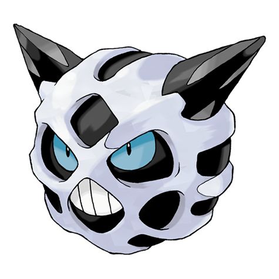

# Glalie (#0362)

*Face Pokemon*

**Type:** Ghiaccio
**Abilities:** [[Inner Focus]], [[Ice Body]], [[Moody]] *(Hidden)*
**Base HP:** 4

> Its body is so hard it was thought to be made of rock. They can be aggressive if provoked. When they hunt, they freeze their prey solid before eating it. They can live in warm places without trouble.

---

## Statistiche (Attributes & Limits)

| Attribute | Base / Limit |
|---|---|
| **Strength** | 2/5 |
| **Dexterity** | 2/5 |
| **Vitality** | 2/5 |
| **Special** | 2/5 |
| **Insight** | 2/5 |

---

## Mosse (Learnset)

- **Starter:** [[Leer|Leer]], [[Powder_Snow|Powder Snow]]
- **Beginner:** [[Bite|Bite]], [[Double_Team|Double Team]]
- **Amateur:** [[Ice_Shard|Ice Shard]], [[Icy_Wind|Icy Wind]], [[Headbutt|Headbutt]], [[Protect|Protect]], [[Ice_Fang|Ice Fang]], [[Ice_Beam|Ice Beam]], [[Frost_Breath|Frost Breath]], [[Freeze_Dry|Freeze Dry]]
- **Ace:** [[Hail|Hail]], [[Crunch|Crunch]], [[Blizzard|Blizzard]], [[Sheer_Cold|Sheer Cold]]
- **Pro:** [[Weather_Ball|Weather Ball]], [[Rollout|Rollout]], [[Iron_Head|Iron Head]]

---

## Correlati

### Catena Evolutiva
- [[0361_Snorunt|Snorunt]]
- [[0362_Glalie|Glalie]]
- Glalie (Mega Form)
- Froslass

---

## Mega Glalie (#0362M1)

**Type:** Ghiaccio
**Abilities:** [[Refrigerate]], [[Moody]] *(Hidden)*
**Base HP:** 5

| Attribute | Base / Limit |
|---|---|
| **Strength** | 3/7 |
| **Dexterity** | 3/6 |
| **Vitality** | 2/5 |
| **Special** | 3/7 |
| **Insight** | 2/5 |

### Mosse

- **Starter:** [[Leer|Leer]], [[Powder_Snow|Powder Snow]]
- **Beginner:** [[Bite|Bite]], [[Double_Team|Double Team]]
- **Amateur:** [[Ice_Shard|Ice Shard]], [[Icy_Wind|Icy Wind]], [[Headbutt|Headbutt]], [[Protect|Protect]], [[Ice_Fang|Ice Fang]], [[Ice_Beam|Ice Beam]], [[Frost_Breath|Frost Breath]], [[Freeze_Dry|Freeze Dry]]
- **Ace:** [[Hail|Hail]], [[Crunch|Crunch]], [[Blizzard|Blizzard]], [[Sheer_Cold|Sheer Cold]]
- **Pro:** [[Weather_Ball|Weather Ball]], [[Rollout|Rollout]], [[Iron_Head|Iron Head]]
