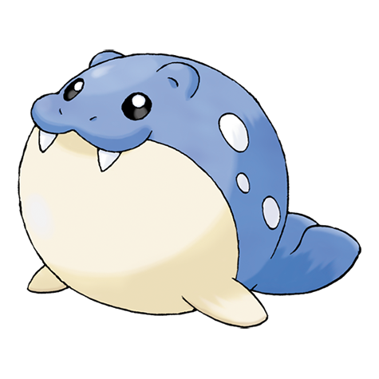

# Spheal (#0363)

*Clap Pokemon*

**Type:** Ghiaccio / Acqua
**Abilities:** [[Thick Fat]], [[Ice Body]], [[Oblivious]] *(Hidden)*
**Base HP:** 3

> They live in big herds with their families. They are bad swimmers but good floaters. To move on land, they roll like balls instead of walking. When they are happy, they clap and squeal, so they can be really noisy.

---

## Statistiche (Attributes & Limits)

| Attribute | Base / Limit |
|---|---|
| **Strength** | 1/3 |
| **Dexterity** | 1/3 |
| **Vitality** | 2/4 |
| **Special** | 2/4 |
| **Insight** | 2/4 |

---

## Mosse (Learnset)

- **Starter:** [[Defense_Curl|Defense Curl]], [[Growl|Growl]], [[Powder_Snow|Powder Snow]]
- **Beginner:** [[Water_Gun|Water Gun]], [[Encore|Encore]]
- **Amateur:** [[Ice_Ball|Ice Ball]], [[Body_Slam|Body Slam]], [[Brine|Brine]], [[Aurora_Beam|Aurora Beam]], [[Hail|Hail]]
- **Ace:** [[Rest|Rest]], [[Snore|Snore]], [[Blizzard|Blizzard]], [[Sheer_Cold|Sheer Cold]]
- **Pro:** [[Dive|Dive]], [[Rollout|Rollout]], [[Endure|Endure]]

---

## Correlati

### Catena Evolutiva
- [[0363_Spheal|Spheal]]
- [[0364_Sealeo|Sealeo]]
- [[0365_Walrein|Walrein]]
