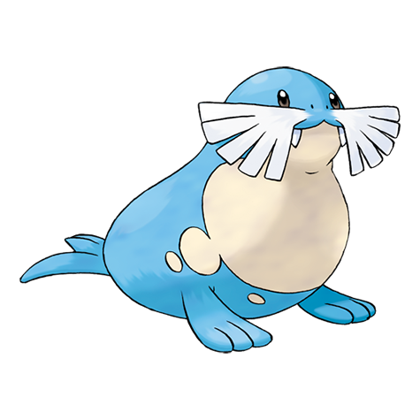

# Sealeo (#0364)

*Ball Roll Pokemon*

**Type:** Ghiaccio / Acqua
**Abilities:** [[Thick Fat]], [[Ice Body]], [[Oblivious]] *(Hidden)*
**Base HP:** 4

> They play with the Spheal in the herd by spinning them with their noses. When they are not in the wild they’ll spin almost any round object, even Pokeballs. Sealeos are great hunters underwater.

---

## Statistiche (Attributes & Limits)

| Attribute | Base / Limit |
|---|---|
| **Strength** | 2/4 |
| **Dexterity** | 2/4 |
| **Vitality** | 2/5 |
| **Special** | 2/5 |
| **Insight** | 2/5 |

---

## Mosse (Learnset)

- **Starter:** [[Defense_Curl|Defense Curl]], [[Growl|Growl]], [[Powder_Snow|Powder Snow]]
- **Beginner:** [[Water_Gun|Water Gun]], [[Encore|Encore]]
- **Amateur:** [[Ice_Ball|Ice Ball]], [[Body_Slam|Body Slam]], [[Brine|Brine]], [[Aurora_Beam|Aurora Beam]], [[Hail|Hail]], [[Swagger|Swagger]]
- **Ace:** [[Rest|Rest]], [[Snore|Snore]], [[Blizzard|Blizzard]], [[Sheer_Cold|Sheer Cold]]
- **Pro:** [[Water_Pulse|Water Pulse]], [[Aqua_Ring|Aqua Ring]], [[Super_Fang|Super Fang]]

---

## Correlati

### Catena Evolutiva
- [[0363_Spheal|Spheal]]
- [[0364_Sealeo|Sealeo]]
- [[0365_Walrein|Walrein]]
