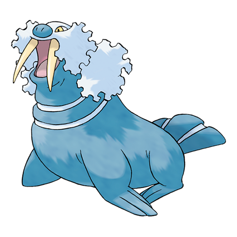

# Walrein (#0365)

*Ice Break Pokemon*

**Type:** Ghiaccio / Acqua
**Abilities:** [[Thick Fat]], [[Ice Body]], [[Oblivious]] *(Hidden)*
**Base HP:** 6

> The leader of the herd is a powerful Walrein. They are very aggressive and will protect their herd even at the cost of their lives. Their tusks can shatter giant blocks of ice. It is relentless and unpredictable.

---

## Statistiche (Attributes & Limits)

| Attribute | Base / Limit |
|---|---|
| **Strength** | 2/5 |
| **Dexterity** | 2/4 |
| **Vitality** | 3/6 |
| **Special** | 3/6 |
| **Insight** | 2/5 |

---

## Mosse (Learnset)

- **Starter:** [[Growl|Growl]], [[Powder_Snow|Powder Snow]]
- **Beginner:** [[Water_Gun|Water Gun]], [[Encore|Encore]]
- **Amateur:** [[Crunch|Crunch]], [[Ice_Ball|Ice Ball]], [[Body_Slam|Body Slam]], [[Brine|Brine]], [[Aurora_Beam|Aurora Beam]], [[Hail|Hail]], [[Swagger|Swagger]], [[Ice_Fang|Ice Fang]]
- **Ace:** [[Snore|Snore]], [[Sheer_Cold|Sheer Cold]], [[Blizzard|Blizzard]], [[Rest|Rest]]
- **Pro:** [[Belly_Drum|Belly Drum]], [[Fissure|Fissure]], [[Aqua_Tail|Aqua Tail]]

---

## Correlati

### Catena Evolutiva
- [[0363_Spheal|Spheal]]
- [[0364_Sealeo|Sealeo]]
- [[0365_Walrein|Walrein]]
