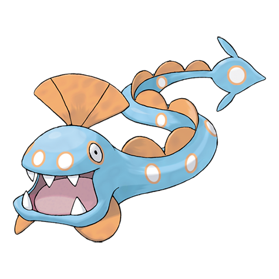

# Huntail (#0367)

*Deep Sea Pokemon*

**Type:** Acqua
**Abilities:** [[Swift Swim]], [[Water Veil]] *(Hidden)*
**Base HP:** 4

> It lives at extreme depths of the sea. Their eyes can see perfectly in complete darkness. Huntails light up their tail to attract their prey, then swallow them whole with a single bite.

---

## Statistiche (Attributes & Limits)

| Attribute | Base / Limit |
|---|---|
| **Strength** | 3/6 |
| **Dexterity** | 2/4 |
| **Vitality** | 3/6 |
| **Special** | 3/6 |
| **Insight** | 2/5 |

---

## Mosse (Learnset)

- **Starter:** [[Whirlpool|Whirlpool]], [[Bite|Bite]]
- **Beginner:** [[Screech|Screech]], [[Feint_Attack|Feint Attack]]
- **Amateur:** [[Water_Pulse|Water Pulse]], [[Scary_Face|Scary Face]], [[Ice_Fang|Ice Fang]], [[Brine|Brine]], [[Baton_Pass|Baton Pass]], [[Crunch|Crunch]], [[Dive|Dive]]
- **Ace:** [[Sucker_Punch|Sucker Punch]], [[Aqua_Tail|Aqua Tail]], [[Coil|Coil]], [[Hydro_Pump|Hydro Pump]]
- **Pro:** [[Muddy_Water|Muddy Water]], [[Bind|Bind]], [[Super_Fang|Super Fang]]

---

## Correlati

### Catena Evolutiva
- [[0366_Clamperl|Clamperl]]
- [[0367_Huntail|Huntail]]
- [[0368_Gorebyss|Gorebyss]]
