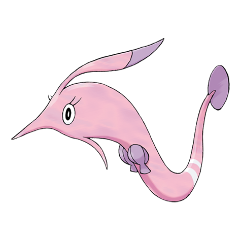

# Gorebyss (#0368)

*South Sea Pokemon*

**Type:** Acqua
**Abilities:** [[Swift Swim]], [[Hydration]] *(Hidden)*
**Base HP:** 4

> Found in the depths of the southern seas. Their body is built to withstand the sea pressure. While it appears to be beautiful and harmless, it is a cruel and deceitful creature.

---

## Statistiche (Attributes & Limits)

| Attribute | Base / Limit |
|---|---|
| **Strength** | 2/5 |
| **Dexterity** | 2/4 |
| **Vitality** | 3/6 |
| **Special** | 3/6 |
| **Insight** | 2/5 |

---

## Mosse (Learnset)

- **Starter:** [[Whirlpool|Whirlpool]], [[Water_Sport|Water Sport]]
- **Beginner:** [[Confusion|Confusion]], [[Agility|Agility]]
- **Amateur:** [[Draining_Kiss|Draining Kiss]], [[Water_Pulse|Water Pulse]], [[Amnesia|Amnesia]], [[Aqua_Ring|Aqua Ring]], [[Captivate|Captivate]], [[Baton_Pass|Baton Pass]], [[Dive|Dive]]
- **Ace:** [[Psychic|Psychic]], [[Aqua_Tail|Aqua Tail]], [[Coil|Coil]], [[Hydro_Pump|Hydro Pump]]
- **Pro:** [[Confuse_Ray|Confuse Ray]], [[Bind|Bind]], [[Muddy_Water|Muddy Water]]

---

## Correlati

### Catena Evolutiva
- [[0366_Clamperl|Clamperl]]
- [[0367_Huntail|Huntail]]
- [[0368_Gorebyss|Gorebyss]]
