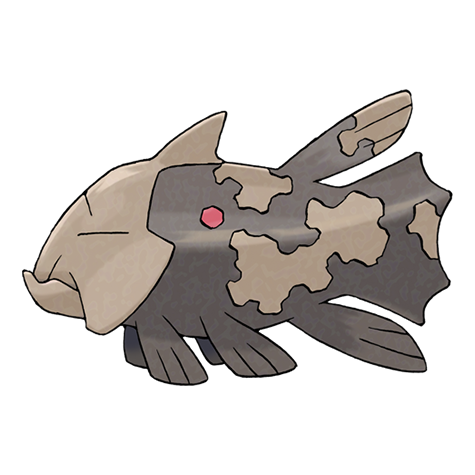

# Relicanth (#0369)

*Longevity Pokemon*

**Type:** Acqua / Roccia
**Abilities:** [[Swift Swim]], [[Rock Head]], [[Sturdy]] *(Hidden)*
**Base HP:** 5

> It has remained unchanged for millions of years. Relicanth was discovered in a deep sea expedition. It feeds on plankton. Their scales are like craggy rocks, they can endure the pressure of the deep sea.

---

## Statistiche (Attributes & Limits)

| Attribute | Base / Limit |
|---|---|
| **Strength** | 2/5 |
| **Dexterity** | 2/4 |
| **Vitality** | 3/7 |
| **Special** | 2/4 |
| **Insight** | 2/4 |

---

## Mosse (Learnset)

- **Starter:** [[Harden|Harden]], [[Tackle|Tackle]], [[Mud_Sport|Mud Sport]]
- **Beginner:** [[Flail|Flail]], [[Water_Gun|Water Gun]]
- **Amateur:** [[Rock_Tomb|Rock Tomb]], [[Yawn|Yawn]], [[Take_Down|Take Down]], [[Ancient_Power|Ancient Power]], [[Rest|Rest]], [[Dive|Dive]]
- **Ace:** [[Double_Edge|Double-Edge]], [[Hydro_Pump|Hydro Pump]], [[Head_Smash|Head Smash]]
- **Pro:** [[Skull_Bash|Skull Bash]], [[Aqua_Tail|Aqua Tail]], [[Magnitude|Magnitude]]

---

