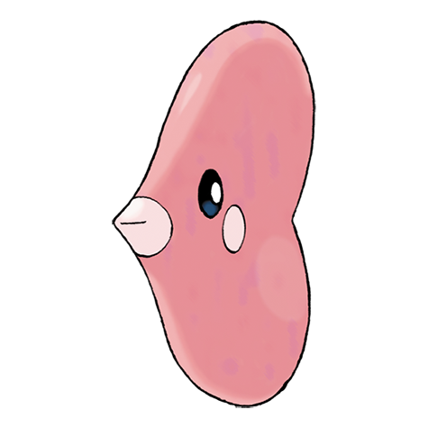

# Luvdisc (#0370)

*Rendezvous Pokemon*

**Type:** Acqua
**Abilities:** [[Swift Swim]], [[Hydration]] *(Hidden)*
**Base HP:** 4

> Luvdisc is a symbol of romance. It lives in shallow seas, swimming after couples, bringing them closer and promising eternal love. During their spawning season, the waters around them turn pink.

---

## Statistiche (Attributes & Limits)

| Attribute | Base / Limit |
|---|---|
| **Strength** | 1/3 |
| **Dexterity** | 3/6 |
| **Vitality** | 2/4 |
| **Special** | 1/3 |
| **Insight** | 2/4 |

---

## Mosse (Learnset)

- **Starter:** [[Tackle|Tackle]], [[Charm|Charm]]
- **Beginner:** [[Water_Gun|Water Gun]], [[Agility|Agility]]
- **Amateur:** [[Take_Down|Take Down]], [[Draining_Kiss|Draining Kiss]], [[Lucky_Chant|Lucky Chant]], [[Water_Pulse|Water Pulse]], [[Heart_Stamp|Heart Stamp]], [[Attract|Attract]], [[Flail|Flail]], [[Sweet_Kiss|Sweet Kiss]]
- **Ace:** [[Hydro_Pump|Hydro Pump]], [[Aqua_Ring|Aqua Ring]], [[Captivate|Captivate]], [[Safeguard|Safeguard]]
- **Pro:** [[Swift|Swift]], [[Heal_Pulse|Heal Pulse]], [[Captivate|Captivate]]

---

