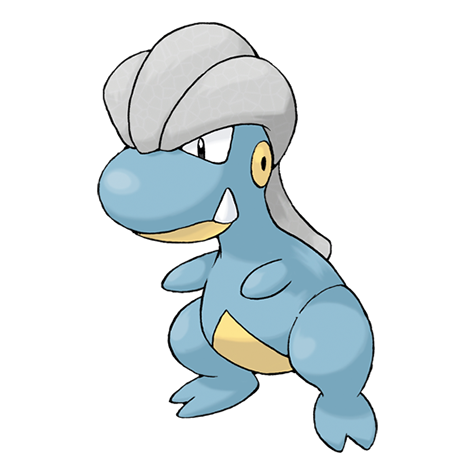

# Bagon (#0371)

*Rock Head Pokemon*

**Type:** Drago
**Abilities:** [[Rock Head]], [[Sheer Force]] *(Hidden)*
**Base HP:** 3

> Bagons dream of soaring the sky. This leads to a lot of frustration that makes them dive off cliffs in an attempt to fly. Their head is tough enough to survive the fall. They are very ill tempered and violent.

---

## Statistiche (Attributes & Limits)

| Attribute | Base / Limit |
|---|---|
| **Strength** | 2/5 |
| **Dexterity** | 2/4 |
| **Vitality** | 2/4 |
| **Special** | 1/3 |
| **Insight** | 1/3 |

---

## Mosse (Learnset)

- **Starter:** [[Rage|Rage]]
- **Beginner:** [[Bite|Bite]], [[Leer|Leer]], [[Ember|Ember]]
- **Amateur:** [[Focus_Energy|Focus Energy]], [[Headbutt|Headbutt]], [[Dragon_Breath|Dragon Breath]], [[Zen_Headbutt|Zen Headbutt]], [[Scary_Face|Scary Face]], [[Crunch|Crunch]]
- **Ace:** [[Dragon_Claw|Dragon Claw]], [[Flamethrower|Flamethrower]], [[Double_Edge|Double-Edge]]
- **Pro:** [[Dragon_Rage|Dragon Rage]], [[Mimic|Mimic]], [[Endure|Endure]]

---

## Correlati

### Catena Evolutiva
- [[0371_Bagon|Bagon]]
- [[0372_Shelgon|Shelgon]]
- [[0373_Salamence|Salamence]]
- Salamence (Mega Form)
