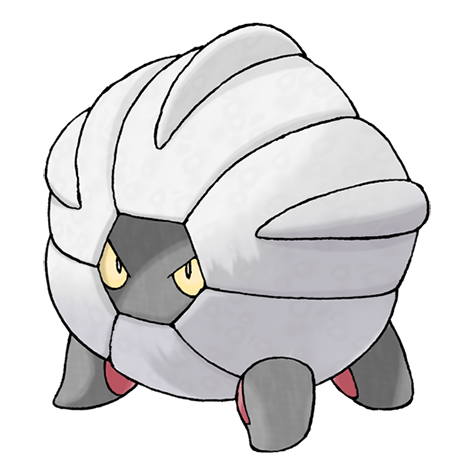

# Shelgon (#0372)

*Endurance Pokemon*

**Type:** Drago
**Abilities:** [[Rock Head]], [[Overcoat]] *(Hidden)*
**Base HP:** 4

> The body is covered in a powerful armor that resembles bones. It hides in caves awaiting evolution, enduring hunger and harm while its cells prepare for its final transformation.

---

## Statistiche (Attributes & Limits)

| Attribute | Base / Limit |
|---|---|
| **Strength** | 3/6 |
| **Dexterity** | 2/4 |
| **Vitality** | 3/6 |
| **Special** | 2/4 |
| **Insight** | 2/4 |

---

## Mosse (Learnset)

- **Starter:** [[Rage|Rage]]
- **Beginner:** [[Bite|Bite]], [[Leer|Leer]], [[Ember|Ember]]
- **Amateur:** [[Focus_Energy|Focus Energy]], [[Headbutt|Headbutt]], [[Protect|Protect]], [[Dragon_Breath|Dragon Breath]], [[Zen_Headbutt|Zen Headbutt]], [[Scary_Face|Scary Face]], [[Crunch|Crunch]]
- **Ace:** [[Dragon_Claw|Dragon Claw]], [[Flamethrower|Flamethrower]], [[Double_Edge|Double-Edge]]
- **Pro:** [[Hydro_Pump|Hydro Pump]], [[Dragon_Pulse|Dragon Pulse]], [[Iron_Defense|Iron Defense]]

---

## Correlati

### Catena Evolutiva
- [[0371_Bagon|Bagon]]
- [[0372_Shelgon|Shelgon]]
- [[0373_Salamence|Salamence]]
- Salamence (Mega Form)
