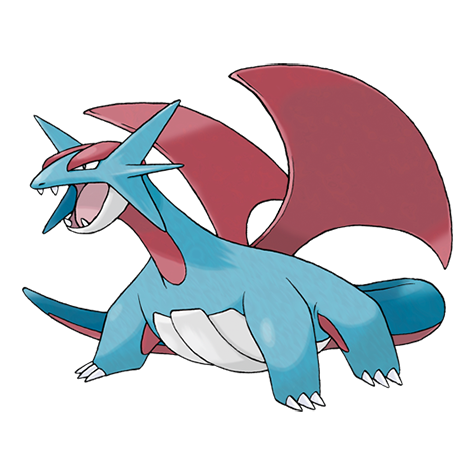

# Salamence (Mega Form) (#0373M1)

*Dragon Pokemon*

**Type:** Drago / Volante
**Abilities:** [[Aerilate]]
**Base HP:** 6

> The power of the Mega Stone gives it the nickname “The blood-soaked Crescent”. It is violent and very unpredictable, even turning on their own trainer. Many believe it is because its bent wings cause it pain.

---

## Statistiche (Attributes & Limits)

| Attribute | Base / Limit |
|---|---|
| **Strength** | 4/8 |
| **Dexterity** | 3/7 |
| **Vitality** | 3/7 |
| **Special** | 3/7 |
| **Insight** | 2/5 |

---

## Mosse (Learnset)

- **Starter:** [[Rage|Rage]]
- **Beginner:** [[Bite|Bite]], [[Leer|Leer]], [[Ember|Ember]], [[Focus_Energy|Focus Energy]]
- **Amateur:** [[Headbutt|Headbutt]], [[Dragon_Breath|Dragon Breath]], [[Focus_Energy|Focus Energy]], [[Thunder_Fang|Thunder Fang]], [[Protect|Protect]], [[Scary_Face|Scary Face]], [[Zen_Headbutt|Zen Headbutt]], [[Crunch|Crunch]], [[Fly|Fly]], [[Dragon_Claw|Dragon Claw]]
- **Ace:** [[Double_Edge|Double-Edge]], [[Flamethrower|Flamethrower]], [[Dragon_Tail|Dragon Tail]]
- **Pro:** [[Outrage|Outrage]], [[Dragon_Dance|Dragon Dance]], [[Draco_Meteor|Draco Meteor]]

---
