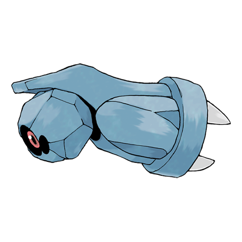

# Beldum (#0374)

*Iron Ball Pokemon*

**Type:** Acciaio / Psico
**Abilities:** [[Clear Body]], [[Light Metal]] *(Hidden)*
**Base HP:** 3

> Beldum uses magnetic pulses to float and communicate. When it finds others, they move in perfect unison. It needs to develop a new brain to evolve; two of them may merge or it could develop a new one with time.

---

## Statistiche (Attributes & Limits)

| Attribute | Base / Limit |
|---|---|
| **Strength** | 2/4 |
| **Dexterity** | 1/3 |
| **Vitality** | 2/5 |
| **Special** | 1/3 |
| **Insight** | 2/4 |

---

## Mosse (Learnset)

- **Starter:** [[Take_Down|Take Down]]
- **Ace:** [[Iron_Head|Iron Head]]
- **Pro:** [[Headbutt|Headbutt]]

---

## Correlati

### Catena Evolutiva
- [[0374_Beldum|Beldum]]
- [[0375_Metang|Metang]]
- [[0376_Metagross|Metagross]]
- Metagross (Mega Form)
