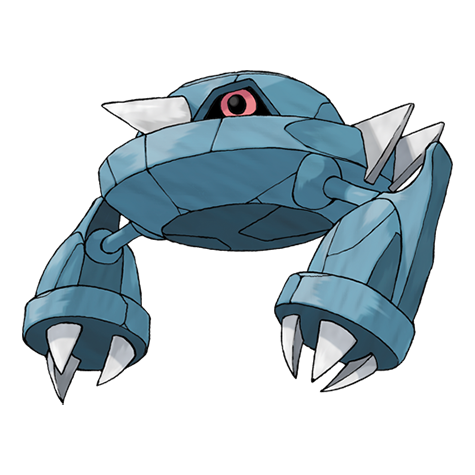

# Metang (#0375)

*Iron Claw Pokemon*

**Type:** Acciaio / Psico
**Abilities:** [[Clear Body]], [[Light Metal]] *(Hidden)*
**Base HP:** 4

> Its two brains are joined by a magnetic nervous system. This allows Metang to use psychokinetic powers. It is able to float and move in midair at 60 mph. To evolve further it will need more brain power.

---

## Statistiche (Attributes & Limits)

| Attribute | Base / Limit |
|---|---|
| **Strength** | 2/5 |
| **Dexterity** | 2/4 |
| **Vitality** | 3/6 |
| **Special** | 2/4 |
| **Insight** | 2/5 |

---

## Mosse (Learnset)

- **Starter:** [[Take_Down|Take Down]]
- **Beginner:** [[Confusion|Confusion]], [[Metal_Claw|Metal Claw]]
- **Amateur:** [[Magnet_Rise|Magnet Rise]], [[Pursuit|Pursuit]], [[Miracle_Eye|Miracle Eye]], [[Zen_Headbutt|Zen Headbutt]], [[Bullet_Punch|Bullet Punch]], [[Scary_Face|Scary Face]], [[Agility|Agility]]
- **Ace:** [[Psychic|Psychic]], [[Meteor_Mash|Meteor Mash]], [[Iron_Defense|Iron Defense]], [[Hyper_Beam|Hyper Beam]]
- **Pro:** [[Thunder_Punch|Thunder Punch]], [[Ice_Punch|Ice Punch]], [[Self_Destruct|Self Destruct]]

---

## Correlati

### Catena Evolutiva
- [[0374_Beldum|Beldum]]
- [[0375_Metang|Metang]]
- [[0376_Metagross|Metagross]]
- Metagross (Mega Form)
