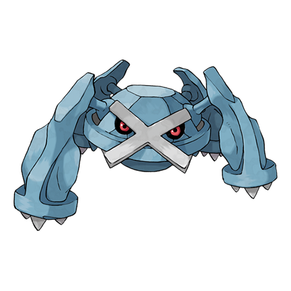

# Metagross (Mega Form) (#0376M1)

*Iron Leg Pokemon*

**Type:** Acciaio / Psico
**Abilities:** [[Tough Claws]]
**Base HP:** 6

> The power of the Mega Stone made its four minds combine. It is now a merciless machine-like beast. If it calculates its chances to win are diminishing it will clutch itself into its foe and self-destruct.

---

## Statistiche (Attributes & Limits)

| Attribute | Base / Limit |
|---|---|
| **Strength** | 4/8 |
| **Dexterity** | 3/6 |
| **Vitality** | 4/8 |
| **Special** | 3/6 |
| **Insight** | 3/6 |

---

## Mosse (Learnset)

- **Starter:** [[Take_Down|Take Down]]
- **Beginner:** [[Confusion|Confusion]], [[Metal_Claw|Metal Claw]]
- **Amateur:** [[Magnet_Rise|Magnet Rise]], [[Pursuit|Pursuit]], [[Miracle_Eye|Miracle Eye]], [[Zen_Headbutt|Zen Headbutt]], [[Bullet_Punch|Bullet Punch]], [[Scary_Face|Scary Face]], [[Agility|Agility]]
- **Ace:** [[Psychic|Psychic]], [[Meteor_Mash|Meteor Mash]], [[Hammer_Arm|Hammer Arm]], [[Iron_Defense|Iron Defense]], [[Hyper_Beam|Hyper Beam]]
- **Pro:** [[Self_Destruct|Self Destruct]], [[Block|Block]], [[Telekinesis|Telekinesis]]

---
