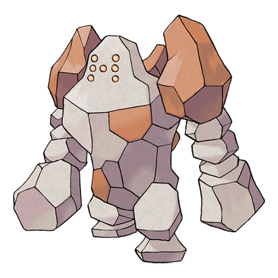

# Regirock (#0377)

*No Data*

**Type:** Roccia
**Abilities:** [[Clear Body]], [[Sturdy]] *(Hidden)*
**Base HP:** 4

> It is said to be an immortal being the size of the peak of a mountain. Could he be a remnant from the most ancient times of this world?

---

## Statistiche (Attributes & Limits)

| Attribute | Base / Limit |
|---|---|
| **Strength** | 6/6 |
| **Dexterity** | 4/4 |
| **Vitality** | 10/10 |
| **Special** | 4/4 |
| **Insight** | 6/6 |

---

## Mosse (Learnset)

- **Master:** [[Stomp|Stomp]], [[Rock_Throw|Rock Throw]], [[Charge_Beam|Charge Beam]], [[Bulldoze|Bulldoze]], [[Curse|Curse]], [[Ancient_Power|Ancient Power]], [[Iron_Defense|Iron Defense]], [[Stone_Edge|Stone Edge]], [[Hammer_Arm|Hammer Arm]], [[Lock_On|Lock-On]], [[Zap_Cannon|Zap Cannon]], [[Superpower|Superpower]], [[Hyper_Beam|Hyper Beam]], [[Explosion|Explosion]], [[Mimic|Mimic]], [[Rock_Slide|Rock Slide]], [[Rock_Smash|Rock Smash]], [[Rock_Polish|Rock Polish]]

---

