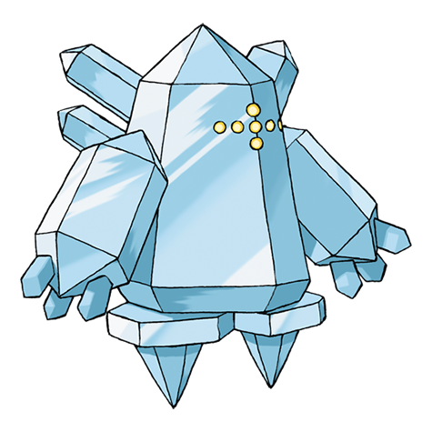

# Regice (#0378)

*No Data*

**Type:** Ghiaccio
**Abilities:** [[Clear Body]], [[Ice Body]] *(Hidden)*
**Base HP:** 4

> It is said to be indistinguishable from a gigantic iceberg. Its myth says its body can’t be melted even if submerged in magma. Regice could freeze the air to bring a new ice age.

---

## Statistiche (Attributes & Limits)

| Attribute | Base / Limit |
|---|---|
| **Strength** | 4/4 |
| **Dexterity** | 4/4 |
| **Vitality** | 6/6 |
| **Special** | 6/6 |
| **Insight** | 10/10 |

---

## Mosse (Learnset)

- **Master:** [[Stomp|Stomp]], [[Icy_Wind|Icy Wind]], [[Charge_Beam|Charge Beam]], [[Bulldoze|Bulldoze]], [[Curse|Curse]], [[Ancient_Power|Ancient Power]], [[Amnesia|Amnesia]], [[Ice_Beam|Ice Beam]], [[Hammer_Arm|Hammer Arm]], [[Lock_On|Lock-On]], [[Zap_Cannon|Zap Cannon]], [[Superpower|Superpower]], [[Hyper_Beam|Hyper Beam]], [[Explosion|Explosion]], [[Mimic|Mimic]], [[Avalanche|Avalanche]], [[Ice_Punch|Ice Punch]], [[Aurora_Veil|Aurora Veil]]

---

