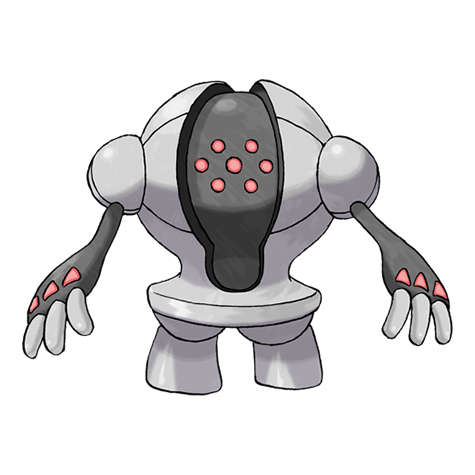

# Registeel (#0379)

*No Data*

**Type:** Acciaio
**Abilities:** [[Clear Body]], [[Light Metal]] *(Hidden)*
**Base HP:** 4

> His body was indestructible. A flexible metal out of this world that can shrink, expand, made solid or liquid at the speed of thought. Could the myths be true?

---

## Statistiche (Attributes & Limits)

| Attribute | Base / Limit |
|---|---|
| **Strength** | 5/5 |
| **Dexterity** | 4/4 |
| **Vitality** | 8/8 |
| **Special** | 5/5 |
| **Insight** | 8/8 |

---

## Mosse (Learnset)

- **Master:** [[Stomp|Stomp]], [[Metal_Claw|Metal Claw]], [[Charge_Beam|Charge Beam]], [[Bulldoze|Bulldoze]], [[Curse|Curse]], [[Ancient_Power|Ancient Power]], [[Iron_Defense|Iron Defense]], [[Amnesia|Amnesia]], [[Iron_Head|Iron Head]], [[Flash_Cannon|Flash Cannon]], [[Hammer_Arm|Hammer Arm]], [[Lock_On|Lock-On]], [[Zap_Cannon|Zap Cannon]], [[Superpower|Superpower]], [[Hyper_Beam|Hyper Beam]], [[Explosion|Explosion]], [[Mimic|Mimic]], [[Block|Block]], [[Endure|Endure]], [[Safeguard|Safeguard]]

---

