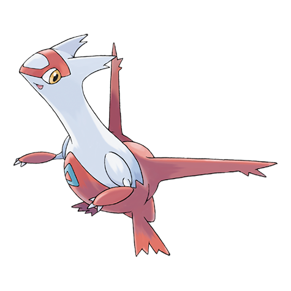
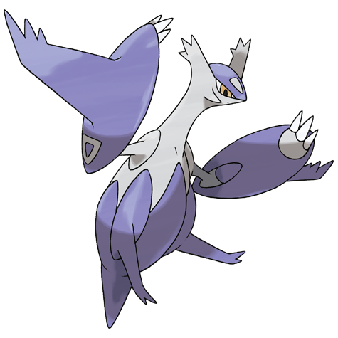

# Latias (#0380)

*No Data*

**Type:** Drago / Psico
**Abilities:** [[Levitate]]
**Base HP:** 4

> The legend tells about two Pokemon that could take human shapes, use psychic powers and become invisible. They were raised by an old couple as their own children. The little girl had a red dress.

---

## Statistiche (Attributes & Limits)

| Attribute | Base / Limit |
|---|---|
| **Strength** | 5/5 |
| **Dexterity** | 6/6 |
| **Vitality** | 5/5 |
| **Special** | 6/6 |
| **Insight** | 7/7 |

---

## Mosse (Learnset)

- **Starter:** [[Helping_Hand|Helping Hand]], [[Safeguard|Safeguard]]
- **Pro:** [[Psywave|Psywave]], [[Wish|Wish]], [[Water_Sport|Water Sport]], [[Charm|Charm]], [[Stored_Power|Stored Power]], [[Refresh|Refresh]], [[Heal_Pulse|Heal Pulse]], [[Dragon_Breath|Dragon Breath]], [[Mist_Ball|Mist Ball]], [[Psycho_Shift|Psycho Shift]], [[Recover|Recover]], [[Reflect_Type|Reflect Type]], [[Zen_Headbutt|Zen Headbutt]], [[Guard_Split|Guard Split]], [[Psychic|Psychic]], [[Dragon_Pulse|Dragon Pulse]], [[Healing_Wish|Healing Wish]], [[Camouflage|Camouflage]], [[Transform|Transform]], [[Role_Play|Role Play]]

---

## Correlati

### Catena Evolutiva
- [[0380_Latias|Latias]]
- Latias (Mega Form)

---

## Mega Latias (#0380M1)

**Type:** Drago / Psico
**Abilities:** [[Levitate]]
**Base HP:** 5

| Attribute | Base / Limit |
|---|---|
| **Strength** | 6/6 |
| **Dexterity** | 6/6 |
| **Vitality** | 7/7 |
| **Special** | 7/7 |
| **Insight** | 8/8 |

### Mosse

- **Starter:** [[Helping_Hand|Helping Hand]], [[Safeguard|Safeguard]]
- **Pro:** [[Psywave|Psywave]], [[Wish|Wish]], [[Water_Sport|Water Sport]], [[Charm|Charm]], [[Stored_Power|Stored Power]], [[Refresh|Refresh]], [[Heal_Pulse|Heal Pulse]], [[Dragon_Breath|Dragon Breath]], [[Mist_Ball|Mist Ball]], [[Psycho_Shift|Psycho Shift]], [[Recover|Recover]], [[Reflect_Type|Reflect Type]], [[Zen_Headbutt|Zen Headbutt]], [[Guard_Split|Guard Split]], [[Psychic|Psychic]], [[Dragon_Pulse|Dragon Pulse]], [[Healing_Wish|Healing Wish]], [[Camouflage|Camouflage]], [[Transform|Transform]], [[Role_Play|Role Play]]
