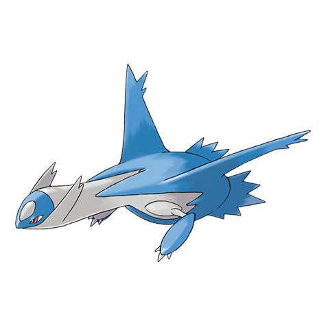
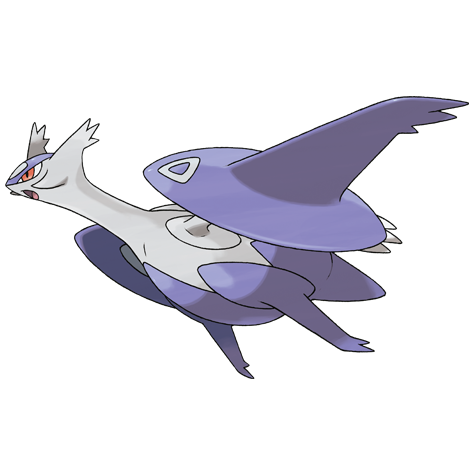

# Latios (#0381)

*No Data*

**Type:** Drago / Psico
**Abilities:** [[Levitate]]
**Base HP:** 4

> The legend tells about two Pokemon that could take human shapes, use psychic powers and become invisible. They were raised by an old couple as their own children. The boy was the oldest and wore a blue shirt.

---

## Statistiche (Attributes & Limits)

| Attribute | Base / Limit |
|---|---|
| **Strength** | 5/5 |
| **Dexterity** | 6/6 |
| **Vitality** | 5/5 |
| **Special** | 7/7 |
| **Insight** | 6/6 |

---

## Mosse (Learnset)

- **Starter:** [[Helping_Hand|Helping Hand]], [[Safeguard|Safeguard]]
- **Pro:** [[Psywave|Psywave]], [[Heal_Block|Heal Block]], [[Protect|Protect]], [[Dragon_Dance|Dragon Dance]], [[Stored_Power|Stored Power]], [[Refresh|Refresh]], [[Heal_Pulse|Heal Pulse]], [[Dragon_Breath|Dragon Breath]], [[Luster_Purge|Luster Purge]], [[Psycho_Shift|Psycho Shift]], [[Recover|Recover]], [[Telekinesis|Telekinesis]], [[Zen_Headbutt|Zen Headbutt]], [[Power_Split|Power Split]], [[Psychic|Psychic]], [[Dragon_Pulse|Dragon Pulse]], [[Memento|Memento]], [[Camouflage|Camouflage]], [[Transform|Transform]], [[Role_Play|Role Play]]

---

## Correlati

### Catena Evolutiva
- [[0381_Latios|Latios]]
- Latios (Mega Form)

---

## Mega Latios (#0381M1)

**Type:** Drago / Psico
**Abilities:** [[Levitate]]
**Base HP:** 5

| Attribute | Base / Limit |
|---|---|
| **Strength** | 7/7 |
| **Dexterity** | 6/6 |
| **Vitality** | 6/6 |
| **Special** | 8/8 |
| **Insight** | 7/7 |

### Mosse

- **Starter:** [[Helping_Hand|Helping Hand]], [[Safeguard|Safeguard]]
- **Pro:** [[Psywave|Psywave]], [[Heal_Block|Heal Block]], [[Protect|Protect]], [[Dragon_Dance|Dragon Dance]], [[Stored_Power|Stored Power]], [[Refresh|Refresh]], [[Heal_Pulse|Heal Pulse]], [[Dragon_Breath|Dragon Breath]], [[Luster_Purge|Luster Purge]], [[Psycho_Shift|Psycho Shift]], [[Recover|Recover]], [[Telekinesis|Telekinesis]], [[Zen_Headbutt|Zen Headbutt]], [[Power_Split|Power Split]], [[Psychic|Psychic]], [[Dragon_Pulse|Dragon Pulse]], [[Memento|Memento]], [[Camouflage|Camouflage]], [[Transform|Transform]], [[Role_Play|Role Play]]
