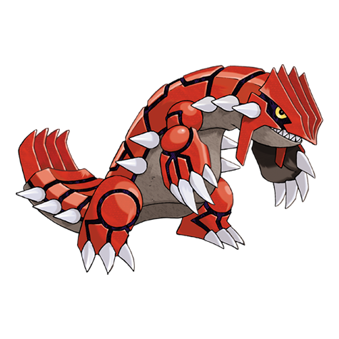

# Groudon (Primal Form) (#0383M1)

*No Data*

**Type:** Terra / Fuoco
**Abilities:** [[Desolate Land]]
**Base HP:** 7

> Millions of years ago chaos reigned. Volcanoes erupting without control, and unbearable heat made all life dry out. Who was so angry inside the raging fire? For its fury has since ingrained into the earth as red rubies.

---

## Statistiche (Attributes & Limits)

| Attribute | Base / Limit |
|---|---|
| **Strength** | 9/9 |
| **Dexterity** | 5/5 |
| **Vitality** | 8/8 |
| **Special** | 8/8 |
| **Insight** | 5/5 |

---

## Mosse (Learnset)

- **Master:** [[Ancient_Power|Ancient Power]], [[Mud_Shot|Mud Shot]], [[Scary_Face|Scary Face]], [[Earth_Power|Earth Power]], [[Lava_Plume|Lava Plume]], [[Rest|Rest]], [[Earthquake|Earthquake]], [[Precipice_Blades|Precipice Blades]], [[Bulk_Up|Bulk Up]], [[Solar_Beam|Solar Beam]], [[Fissure|Fissure]], [[Fire_Blast|Fire Blast]], [[Hammer_Arm|Hammer Arm]], [[Eruption|Eruption]], [[Mud_Sport|Mud Sport]], [[Dig|Dig]], [[Strength|Strength]], [[Block|Block]], [[Stealth_Rock|Stealth Rock]], [[Rock_Smash|Rock Smash]], [[Flame_Wheel|Flame Wheel]], [[Heat_Crash|Heat Crash]], [[Sandstorm|Sandstorm]], [[Wide_Guard|Wide Guard]], [[Rock_Climb|Rock Climb]]

---
