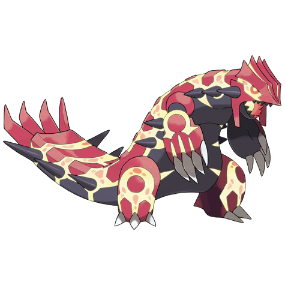

# Groudon (#0383)

*No Data*

**Type:** Terra
**Abilities:** [[Drought]]
**Base HP:** 5

> Described in mythology as the God creator of lands, mountains, volcanoes and continents. Any water or clouds evaporate in its presence. It is the mortal enemy of Kyogre.

---

## Statistiche (Attributes & Limits)

| Attribute | Base / Limit |
|---|---|
| **Strength** | 8/8 |
| **Dexterity** | 5/5 |
| **Vitality** | 7/7 |
| **Special** | 6/6 |
| **Insight** | 5/5 |

---

## Mosse (Learnset)

- **Master:** [[Ancient_Power|Ancient Power]], [[Mud_Shot|Mud Shot]], [[Scary_Face|Scary Face]], [[Earth_Power|Earth Power]], [[Lava_Plume|Lava Plume]], [[Rest|Rest]], [[Earthquake|Earthquake]], [[Precipice_Blades|Precipice Blades]], [[Bulk_Up|Bulk Up]], [[Solar_Beam|Solar Beam]], [[Fissure|Fissure]], [[Fire_Blast|Fire Blast]], [[Hammer_Arm|Hammer Arm]], [[Eruption|Eruption]], [[Mud_Sport|Mud Sport]], [[Dig|Dig]], [[Strength|Strength]], [[Block|Block]], [[Stealth_Rock|Stealth Rock]], [[Rock_Smash|Rock Smash]], [[Flame_Wheel|Flame Wheel]], [[Heat_Crash|Heat Crash]], [[Sandstorm|Sandstorm]], [[Wide_Guard|Wide Guard]], [[Rock_Climb|Rock Climb]]

---

## Correlati

### Catena Evolutiva
- [[0383_Groudon|Groudon]]
- Groudon (Primal Form)

---

## Groudon Primordiale (#0383M1)

**Type:** Terra / Fuoco
**Abilities:** [[Desolate Land]]
**Base HP:** 7

| Attribute | Base / Limit |
|---|---|
| **Strength** | 9/9 |
| **Dexterity** | 5/5 |
| **Vitality** | 8/8 |
| **Special** | 8/8 |
| **Insight** | 5/5 |

### Mosse

- **Master:** [[Ancient_Power|Ancient Power]], [[Mud_Shot|Mud Shot]], [[Scary_Face|Scary Face]], [[Earth_Power|Earth Power]], [[Lava_Plume|Lava Plume]], [[Rest|Rest]], [[Earthquake|Earthquake]], [[Precipice_Blades|Precipice Blades]], [[Bulk_Up|Bulk Up]], [[Solar_Beam|Solar Beam]], [[Fissure|Fissure]], [[Fire_Blast|Fire Blast]], [[Hammer_Arm|Hammer Arm]], [[Eruption|Eruption]], [[Mud_Sport|Mud Sport]], [[Dig|Dig]], [[Strength|Strength]], [[Block|Block]], [[Stealth_Rock|Stealth Rock]], [[Rock_Smash|Rock Smash]], [[Flame_Wheel|Flame Wheel]], [[Heat_Crash|Heat Crash]], [[Sandstorm|Sandstorm]], [[Wide_Guard|Wide Guard]], [[Rock_Climb|Rock Climb]]
