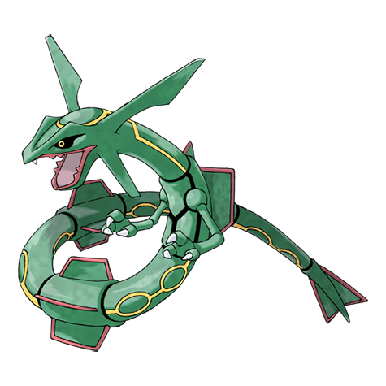

# Rayquaza (#0384)

*No Data*

**Type:** Drago / Volante
**Abilities:** [[Air Lock]]
**Base HP:** 8

> The legend tells how Rayquaza lived in the outer layer of this world. It came to end the quarrel between Groudon and Kyogre, granted the world with blue skies and then left.

---

## Statistiche (Attributes & Limits)

| Attribute | Base / Limit |
|---|---|
| **Strength** | 8/8 |
| **Dexterity** | 6/6 |
| **Vitality** | 5/5 |
| **Special** | 8/8 |
| **Insight** | 5/5 |

---

## Mosse (Learnset)

- **Master:** [[Twister|Twister]], [[Scary_Face|Scary Face]], [[Ancient_Power|Ancient Power]], [[Crunch|Crunch]], [[Air_Slash|Air Slash]], [[Rest|Rest]], [[Extreme_Speed|Extreme Speed]], [[Dragon_Pulse|Dragon Pulse]], [[Dragon_Dance|Dragon Dance]], [[Fly|Fly]], [[Hyper_Voice|Hyper Voice]], [[Outrage|Outrage]], [[Hyper_Beam|Hyper Beam]], [[Roar|Roar]], [[Dragon_Ascent|Dragon Ascent]], [[Sky_Drop|Sky Drop]], [[Defog|Defog]], [[Tailwind|Tailwind]], [[Rain_Dance|Rain Dance]], [[Sunny_Day|Sunny Day]], [[Dive|Dive]], [[Dig|Dig]], [[Draco_Meteor|Draco Meteor]], [[Hurricane|Hurricane]], [[Cosmic_Power|Cosmic Power]]

---

## Correlati

### Catena Evolutiva
- [[0384_Rayquaza|Rayquaza]]
- Rayquaza (Mega Form)

---

## Mega Rayquaza (#0384M1)

**Type:** Drago / Volante
**Abilities:** [[Delta Stream]]
**Base HP:** 11

| Attribute | Base / Limit |
|---|---|
| **Strength** | 9/9 |
| **Dexterity** | 6/6 |
| **Vitality** | 6/6 |
| **Special** | 9/9 |
| **Insight** | 6/6 |

### Mosse

- **Master:** [[Twister|Twister]], [[Scary_Face|Scary Face]], [[Ancient_Power|Ancient Power]], [[Crunch|Crunch]], [[Air_Slash|Air Slash]], [[Rest|Rest]], [[Extreme_Speed|Extreme Speed]], [[Dragon_Pulse|Dragon Pulse]], [[Dragon_Dance|Dragon Dance]], [[Fly|Fly]], [[Hyper_Voice|Hyper Voice]], [[Outrage|Outrage]], [[Hyper_Beam|Hyper Beam]], [[Roar|Roar]], [[Dragon_Ascent|Dragon Ascent]], [[Sky_Drop|Sky Drop]], [[Defog|Defog]], [[Tailwind|Tailwind]], [[Rain_Dance|Rain Dance]], [[Sunny_Day|Sunny Day]], [[Dive|Dive]], [[Dig|Dig]], [[Draco_Meteor|Draco Meteor]], [[Hurricane|Hurricane]], [[Cosmic_Power|Cosmic Power]]
