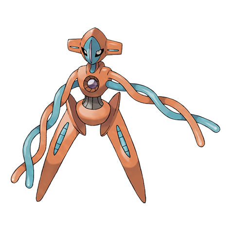

# Deoxys (#0386)

*No Data*

**Type:** Psico
**Abilities:** [[Pressure]]
**Base HP:** 4

> A space expedition had to be aborted due to an emergency. The ship’s crew mentioned a creature attacking them inside their ship. They all gave different descriptions of said creature.

---

## Statistiche (Attributes & Limits)

| Attribute | Base / Limit |
|---|---|
| **Strength** | 8/8 |
| **Dexterity** | 8/8 |
| **Vitality** | 4/4 |
| **Special** | 8/8 |
| **Insight** | 4/4 |

---

## Mosse (Learnset)

- **Master:** [[Leer|Leer]], [[Wrap|Wrap]], [[Night_Shade|Night Shade]], [[Teleport|Teleport]], [[Knock_Off|Knock Off]], [[Pursuit|Pursuit]], [[Psychic|Psychic]], [[Snatch|Snatch]], [[Psycho_Shift|Psycho Shift]], [[Zen_Headbutt|Zen Headbutt]], [[Cosmic_Power|Cosmic Power]], [[Recover|Recover]], [[Psycho_Boost|Psycho Boost]], [[Hyper_Beam|Hyper Beam]], [[Toxic|Toxic]], [[Laser_Focus|Laser Focus]], [[Bind|Bind]], [[Signal_Beam|Signal Beam]]

---

## Correlati

### Catena Evolutiva
- [[0386_Deoxys|Deoxys]]
- Deoxys (Attack Form)
- Deoxys (Defense Form)
- Deoxys (Speed Form)
