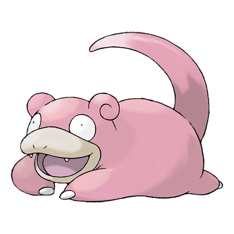

# Slowpoke (Galarian Form) (#0079G)

**

**Type:** Psico
**Abilities:** [[Gluttony]], [[Own Tempo]], [[Regenerator]] *(Hidden)*
**Base HP:** 3

> 

---

## Statistiche (Attributes & Limits)

| Attribute | Base / Limit |
|---|---|
| **Strength** | 2/4 |
| **Dexterity** | 1/2 |
| **Vitality** | 2/4 |
| **Special** | 1/3 |
| **Insight** | 1/3 |

---

## Mosse (Learnset)

- **Starter:** [[Tackle|Tackle]], [[Curse|Curse]]
- **Beginner:** [[Growl|Growl]], [[Acid|Acid]], [[Yawn|Yawn]], [[Confusion|Confusion]]
- **Amateur:** [[Disable|Disable]], [[Water_Pulse|Water Pulse]], [[Headbutt|Headbutt]], [[Zen_Headbutt|Zen Headbutt]], [[Amnesia|Amnesia]], [[Surf|Surf]], [[Slack_Off|Slack Off]]
- **Ace:** [[Psychic|Psychic]], [[Psych_Up|Psych Up]], [[Rain_Dance|Rain Dance]], [[Heal_Pulse|Heal Pulse]]
- **Pro:** [[Foul_Play|Foul Play]], [[Expanding_Force|Expanding Force]], [[Belch|Belch]]

---
