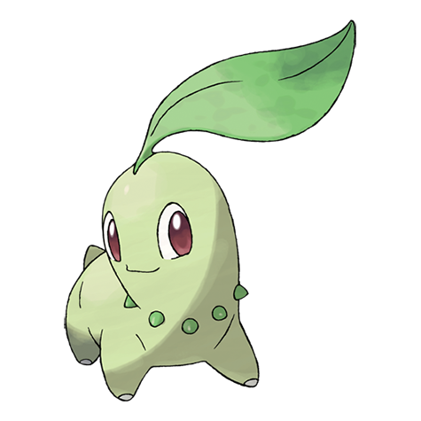

# Chikorita (#0152)

*Leaf Pokemon*

**Type:** Erba
**Abilities:** [[Overgrow]], [[Leaf Guard]] *(Hidden)*
**Base HP:** 3

> It is docile and loves to bathe in the sunlight. It waves its leaf around to keep foes at bay. The sweet fragrance from its leaf, has a strong calming and relaxing effect on people and Pokemon.

---

## Statistiche (Attributes & Limits)

| Attribute | Base / Limit |
|---|---|
| **Strength** | 2/4 |
| **Dexterity** | 2/4 |
| **Vitality** | 2/4 |
| **Special** | 2/4 |
| **Insight** | 2/4 |

---

## Mosse (Learnset)

- **Starter:** [[Tackle|Tackle]], [[Growl|Growl]]
- **Beginner:** [[Razor_Leaf|Razor Leaf]], [[Poison_Powder|Poison Powder]], [[Sweet_Scent|Sweet Scent]]
- **Amateur:** [[Reflect|Reflect]], [[Synthesis|Synthesis]], [[Natural_Gift|Natural Gift]], [[Magical_Leaf|Magical Leaf]], [[Light_Screen|Light Screen]], [[Body_Slam|Body Slam]]
- **Ace:** [[Safeguard|Safeguard]], [[Aromatherapy|Aromatherapy]], [[Solar_Beam|Solar Beam]]
- **Pro:** [[Heal_Pulse|Heal Pulse]], [[Grass_Pledge|Grass Pledge]], [[Grassy_Terrain|Grassy Terrain]]

---

## Correlati

### Catena Evolutiva
- [[0152_Chikorita|Chikorita]]
- [[0153_Bayleef|Bayleef]]
- [[0154_Meganium|Meganium]]
