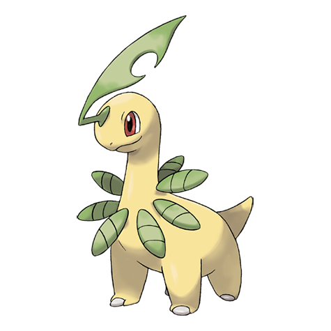

# Bayleef (#0153)

*Leaf Pokemon*

**Type:** Erba
**Abilities:** [[Overgrow]], [[Leaf Guard]] *(Hidden)*
**Base HP:** 4

> A spicy fragrance emanates from around its neck that makes it feisty and impetuous. It sheds its leaves every couple of weeks after the aroma diminishes and its mood also becomes calmer.

---

## Statistiche (Attributes & Limits)

| Attribute | Base / Limit |
|---|---|
| **Strength** | 2/4 |
| **Dexterity** | 2/4 |
| **Vitality** | 2/5 |
| **Special** | 2/4 |
| **Insight** | 2/5 |

---

## Mosse (Learnset)

- **Starter:** [[Tackle|Tackle]], [[Growl|Growl]]
- **Beginner:** [[Razor_Leaf|Razor Leaf]], [[Poison_Powder|Poison Powder]], [[Sweet_Scent|Sweet Scent]]
- **Amateur:** [[Reflect|Reflect]], [[Synthesis|Synthesis]], [[Natural_Gift|Natural Gift]], [[Magical_Leaf|Magical Leaf]], [[Light_Screen|Light Screen]], [[Body_Slam|Body Slam]]
- **Ace:** [[Safeguard|Safeguard]], [[Aromatherapy|Aromatherapy]], [[Solar_Beam|Solar Beam]]
- **Pro:** [[Heal_Pulse|Heal Pulse]], [[Grass_Pledge|Grass Pledge]], [[Grassy_Terrain|Grassy Terrain]]

---

## Correlati

### Catena Evolutiva
- [[0152_Chikorita|Chikorita]]
- [[0153_Bayleef|Bayleef]]
- [[0154_Meganium|Meganium]]
