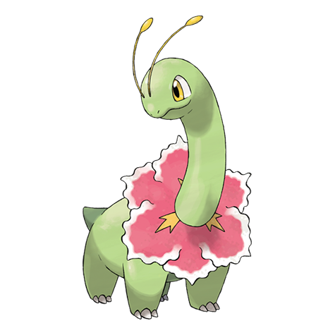

# Meganium (#0154)

*Herb Pokemon*

**Type:** Erba
**Abilities:** [[Overgrow]], [[Leaf Guard]] *(Hidden)*
**Base HP:** 5

> Meganium's breath has the power to revive dead grass and plants. The aroma that comes from its petals contains a substance that calms aggressive feelings and helps others to restore health.

---

## Statistiche (Attributes & Limits)

| Attribute | Base / Limit |
|---|---|
| **Strength** | 2/5 |
| **Dexterity** | 2/5 |
| **Vitality** | 3/6 |
| **Special** | 2/5 |
| **Insight** | 3/6 |

---

## Mosse (Learnset)

- **Starter:** [[Growl|Growl]], [[Tackle|Tackle]]
- **Beginner:** [[Poison_Powder|Poison Powder]], [[Razor_Leaf|Razor Leaf]], [[Sweet_Scent|Sweet Scent]]
- **Amateur:** [[Synthesis|Synthesis]], [[Reflect|Reflect]], [[Magical_Leaf|Magical Leaf]], [[Natural_Gift|Natural Gift]], [[Light_Screen|Light Screen]], [[Body_Slam|Body Slam]]
- **Ace:** [[Petal_Blizzard|Petal Blizzard]], [[Petal_Dance|Petal Dance]], [[Aromatherapy|Aromatherapy]], [[Solar_Beam|Solar Beam]]
- **Pro:** [[Frenzy_Plant|Frenzy Plant]], [[Ancient_Power|Ancient Power]], [[Grassy_Terrain|Grassy Terrain]]

---

## Correlati

### Catena Evolutiva
- [[0152_Chikorita|Chikorita]]
- [[0153_Bayleef|Bayleef]]
- [[0154_Meganium|Meganium]]
